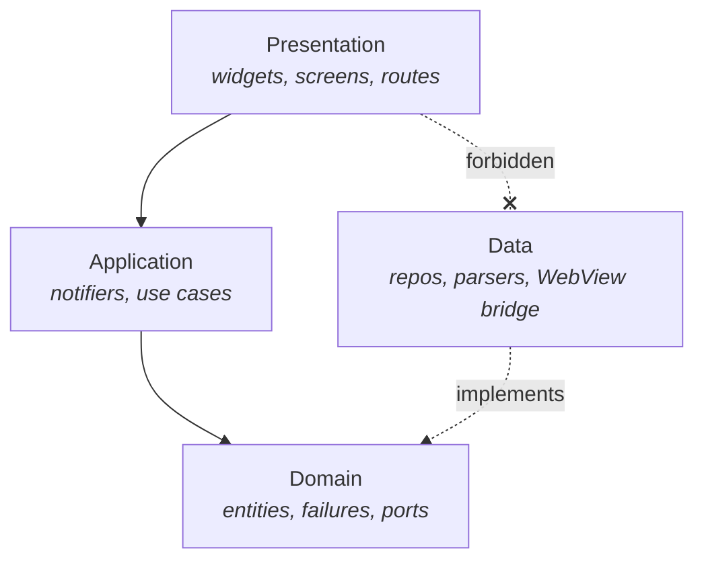
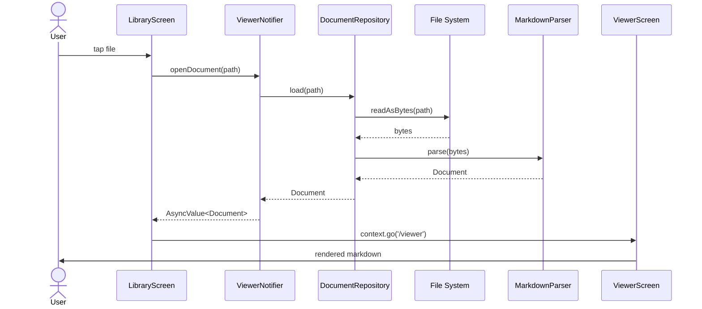

# Architecture

## Principles

1. **Clean architecture** — domain at the center, frameworks at the edges
2. **Feature-first structure** — group by feature, not by type
3. **Unidirectional data flow** — UI → application → domain → data
4. **Dependency inversion** — domain defines interfaces, data implements them
5. **Riverpod as the composition root** — all dependencies flow through providers

## Layers

The four-layer dependency graph (arrows point in the *depends on* direction;
the dashed arrow indicates *implements*):

## Layer Rules

- **Domain** — zero dependencies on Flutter, no imports from other layers
- **Application** — depends on domain; may also import pure Dart and
  Riverpod packages (`flutter_riverpod`, `riverpod_annotation`,
  `compute` from `package:flutter/foundation.dart`, `markdown` for
  pipeline extension). Must not import `package:flutter/widgets.dart`,
  `package:flutter/material.dart`, or any file under a feature's
  `data/` tree — see
  [standards/architecture-standards.md](standards/architecture-standards.md)
  for the full matrix.
- **Data** — depends on domain (implements ports); never on presentation
- **Presentation** — depends on application and domain; never on data
- **Wiring** — always through Riverpod providers, never via direct
  constructor wiring from a widget to a repository

Layer-dependency enforcement is documented in
[standards/architecture-standards.md](standards/architecture-standards.md)
and verified in code review.

## Feature Modules

Each feature lives under `lib/features/<name>/` and contains the four
layer folders: `domain/`, `application/`, `data/`, `presentation/`.
Shared primitives live under `lib/core/`.

Initial feature modules:

- `viewer` — document loading and rendering
- `library` — recent and favorite file management
- `settings` — theme, font, and reading preferences
- `search` — in-document search
- `share` — share-intent import and PDF export
- `repo_sync` — pull markdown documents from public git repositories
  (see [ADR-0012](decisions/0012-document-sync-architecture.md))

## Data Flow Example: Opening a File

End-to-end interaction when the user opens a markdown file from the library:

Step-by-step:

1. User taps a file in `LibraryScreen` (presentation)
2. `openDocumentProvider` use case is invoked (application)
3. Use case calls `DocumentRepository.load(path)` (domain port)
4. `DocumentRepositoryImpl` reads bytes and invokes `MarkdownParser` (data)
5. Parsed `Document` entity flows back up through the same boundary
6. `ViewerScreen` is routed via `go_router`
7. `ViewerNotifier` exposes the document as `AsyncValue<Document>`
8. Widgets rebuild with the parsed content

## Error Handling Philosophy

- Domain defines typed failures via a `sealed class Failure`
- Application converts exceptions to failures at layer boundaries
- Presentation maps failures to localized user messages
- Full rules in
  [standards/error-handling-standards.md](standards/error-handling-standards.md)

## Concurrency Model

- Parsing runs in a background isolate via `compute()` for docs > 200KB
- Mermaid rendering is async via a pre-warmed `InAppWebView`
- File I/O uses async streams; no blocking reads on the UI isolate
- Long-running operations are cancelled on notifier disposal
