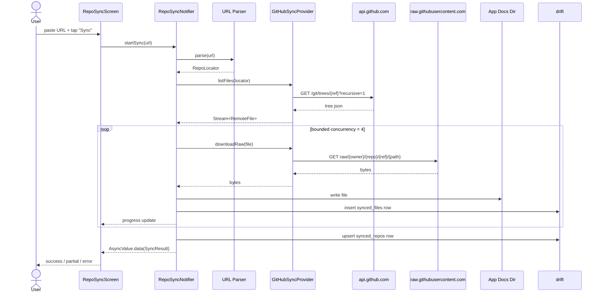

# ADR-0012: Document sync from public git repositories

- **Status**: Accepted
- **Date**: 2026-04-12
- **Depends on**: [ADR-0011](0011-network-access-policy.md)

## Context

Users want to mirror a project's documentation onto their device by
pasting a public git repository URL — for example
`https://github.com/owner/repo/tree/main/docs`. The app should
discover all `.md` files at and below that path, download them, and
preserve the directory structure locally.

Forces:

- Must work without an account on the remote provider
- Must respect provider rate limits
- Must support large directories (50–500 files) without freezing the UI
- Must handle partial failure (network blip, single file 404, etc.)
- Must be re-runnable to refresh content
- Must remain a self-contained feature module (`features/repo_sync/`)

## Decision

We will build a `repo_sync` feature module that uses a **provider
abstraction** plus a **GitHub-first implementation**, persists synced
content under the app documents directory, and tracks every synced repo
in a `drift` table.

### Provider Abstraction

```dart
abstract interface class RepoSyncProvider {
  bool canHandle(Uri url);
  Future<RepoLocator> parse(Uri url);
  Stream<RemoteFile> listFiles(RepoLocator locator);
  Future<List<int>> downloadRaw(RemoteFile file);
}
```

The v1 implementation is `GitHubSyncProvider`. Post-v1 candidates:
GitLab, Bitbucket, Gitea, generic raw HTTP.

### URL Parsing

Accept all of:

- `https://github.com/{owner}/{repo}` — defaults to default branch, root path
- `https://github.com/{owner}/{repo}/tree/{ref}` — entire branch
- `https://github.com/{owner}/{repo}/tree/{ref}/{path}` — sub-path
- `https://github.com/{owner}/{repo}/blob/{ref}/{path}` — single file

Parse into a typed `RepoLocator { provider, owner, repo, ref, path }`.
Reject anything else with a clear error.

### Discovery

Use the GitHub REST API:

```
GET /repos/{owner}/{repo}/git/trees/{ref}?recursive=1
```

Filter the response client-side to entries:

- whose `path` starts with the requested sub-path
- whose `type` is `blob`
- whose extension is `.md` or `.markdown`

A single recursive call returns the whole tree, which avoids per-directory
walking. For trees that exceed GitHub's `truncated: true` limit, fall
back to recursive `contents/{path}` calls per directory.

### Download

Use `https://raw.githubusercontent.com/{owner}/{repo}/{ref}/{path}` for
file content. Raw downloads do **not** count against the GitHub REST API
rate limit and are simpler than the contents API (no base64 decoding).

### Concurrency

- Discovery: 1 request
- Downloads: bounded concurrency, default 4 in-flight requests
- The whole sync runs in a background isolate via `compute()` so the UI
  isolate stays at 60fps
- Cancellation propagates from the UI to the isolate

### Storage Layout

```
<app-documents>/synced_repos/
  <provider>/<owner>/<repo>/<ref>/
    <path>/
      file1.md
      sub/file2.md
```

Slashes in `ref` (e.g. `feature/foo`) are URL-encoded.

### Tracking

A `drift` table `synced_repos`:

| column | type | notes |
|--------|------|-------|
| id | int (pk) | |
| provider | text | `github` |
| owner | text | |
| repo | text | |
| ref | text | branch / tag / commit |
| sub_path | text | empty for root |
| local_root | text | absolute path under app docs |
| last_synced_at | int (epoch ms) | |
| file_count | int | |
| status | text | `ok`, `partial`, `failed` |

A second table `synced_files` records per-file path, sha, size, and
status — used by the UI for progress, partial-failure recovery, and the
"removed remotely" cleanup pass.

### Authentication

- Anonymous by default — 60 unauthenticated requests/hour is enough for
  small docs trees because we issue 1 discovery + N raw downloads (raw
  does not count against the limit)
- Optional Personal Access Token stored in platform secure storage
  (`flutter_secure_storage`), entered by the user in settings, scoped to
  `public_repo` only

### Error Handling

Sync failures map to `Failure` types:

- `NetworkUnavailableFailure` — no connectivity
- `RateLimitedFailure` — 403 with `X-RateLimit-Remaining: 0`
- `RepoNotFoundFailure` — 404
- `PathNotFoundFailure` — sub-path missing
- `PartialSyncFailure` — some files succeeded, some failed
- `UnsupportedProviderFailure` — URL didn't match any provider

The sync always commits whatever it managed to download — partial
results are preferable to nothing.

### HTTP Client

Use **`dio`** (≥ 5.4) for the shared HTTP client:

- Interceptor for User-Agent, accept headers, and optional auth
- Built-in retry on transient 5xx
- Cancellation tokens

### Sync Flow



## Consequences

### Positive

- Users can pull a project's documentation onto their device with one URL
- Mirrored layout means relative links between docs keep working
- Provider abstraction makes adding GitLab/Bitbucket cheap later
- Bounded concurrency keeps the device responsive
- Anonymous sync covers most public repositories within rate limits

### Negative

- Adds `dio` and `flutter_secure_storage` as new dependencies
- Adds a new feature module with its own UI surface
- GitHub API changes could break discovery — requires monitoring
- The local mirror duplicates content already in the cloud (intentional
  for offline reading, but uses disk space)
- More complex error handling than any other feature

## Alternatives Considered

### Use `git` clone via `libgit2`/`dart_git`

Rejected: pulling the entire repo wastes bandwidth and storage when the
user only wants `docs/`, and shallow clones add complexity. A full clone
would also pull binary assets we don't need.

### Use the GitHub Contents API for downloads

Rejected: the contents API counts against the REST rate limit and
returns base64-encoded content, both of which are worse than `raw.githubusercontent.com`.

### Render directly from URLs without local mirroring

Rejected: defeats offline reading and forces network on every read.

### Use `package:http` instead of `dio`

Considered. Rejected for v1 because we want built-in cancellation,
interceptors, and retry — implementing these on top of `package:http`
would duplicate `dio`'s feature set. We may revisit if `dio`'s
maintenance status changes.
