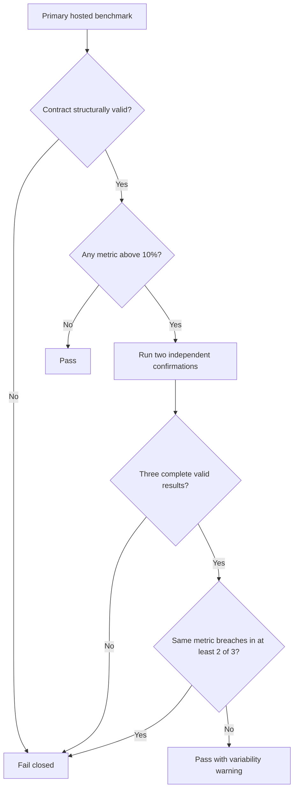

# ADR-0028: Confirm hosted performance regressions across independent runners

- **Status**: Proposed
- **Date**: 2026-07-30
- **Deciders**: Cemil Ilık
- **Owner**: Cemil Ilık
- **Revisit date**: 2026-10-30
- **Amends if accepted**:
  [ADR-0027](0027-performance-measurement-tiers.md), only the hosted
  regression verdict, and
  [ADR-0026](0026-risk-scoped-integration-and-performance-gates.md), only the
  distinction between performance confirmation and retry
- **Related**:
  [ADR-0024](0024-platform-support-and-responsive-layout.md),
  [ADR-0025](0025-codegen-lint-and-toolchain-maintenance.md)

This ADR makes a hosted performance failure depend on replicated evidence
without weakening any product budget or hosted regression threshold.

## Context

ADR-0027 adopted a maximum-of-five hosted baseline with a fixed 10-percent
regression threshold because independently provisioned GitHub-hosted runners
varied substantially even when the guest profile was identical. The first
positive enforcement run then disproved the remaining assumption that one
later hosted result was sufficient for a blocking verdict.

The five accepted calibration results and the positive enforcement run
reported these decode-and-parse values:

| Observation | Value | Runner image revision | Guest memory |
|-------------|------:|-----------------------|-------------:|
| Calibration 1 | 690.923 ms | `20260720.247.2` | 2,531,948 KiB |
| Calibration 2 | 548.231 ms | `20260720.247.2` | 2,531,944 KiB |
| Calibration 3, infrastructure retry | 675.465 ms | `20260726.254.1` | 2,531,948 KiB |
| Calibration 4 | 683.375 ms | `20260720.247.2` | 2,531,948 KiB |
| Calibration 5 | 685.976 ms | `20260726.254.1` | 2,531,944 KiB |
| Positive enforcement run | 877.254 ms | `20260720.247.2` | 2,531,948 KiB |

The calibrated baseline was 690.923 ms and its permitted upper value was
760.0153 ms. The enforcement result was approximately 27 percent above the
baseline even though:

- the complete stable profile identity matched byte for byte;
- the runner image revision and observed guest memory matched previous valid
  calibration observations;
- the measured code path was unchanged between calibration and enforcement;
- all five repetitions in the enforcement run were tightly grouped between
  868.071 ms and 904.756 ms, so the run-level median was not caused by one
  repetition outlier;
- every other hosted metric passed; and
- the critical Mermaid integration suite and benchmark suite both completed
  successfully without an ADB, emulator, schema, or fixture fault.

Re-running this red result ad hoc would violate ADR-0026. Raising the baseline
after observing the failure would violate ADR-0027. The evidence instead
triggers ADR-0027's early revisit condition: the hosted spread is still too
wide for a single independently provisioned runner to provide a useful
blocking signal.

## Decision

### Preserve the existing performance contracts

The following rules remain unchanged:

- physical reference-device product budgets stay normative and byte for byte
  unchanged;
- the hosted profile, fixtures, one warm-up, five repetitions, aggregation
  rules, and result schema remain unchanged;
- the hosted baseline remains the maximum of exactly five reviewed,
  independently provisioned calibration results;
- a hosted metric breaches when its run-level value is more than 10 percent
  above its baseline value; exactly 10 percent remains permitted; and
- baseline increases still require a dedicated reviewed calibration commit
  with before-and-after evidence and an identified cause.

The enforcement outlier recorded above is not a reason to increase a baseline
or threshold.

### Treat the first breach as provisional

Every hosted benchmark gate starts with one primary run. A complete primary
result that has no metric breach passes without allocating another runner.

If one or more metrics breach in the primary result, that result is a
provisional signal. The workflow then starts exactly two benchmark-only
confirmation jobs on independently provisioned runners. The confirmation jobs
use the same commit, stable profile, fixtures, baseline, and comparison
contract as the primary run.

This diagram shows how a hosted verdict is reached.

The final gate fails for performance only when the same metric breaches in at
least two of the three complete results. A metric that breaches in only one
result does not establish a regression. The gate passes with a visible
variability warning and retains all three raw results.

Different metrics breaching only once each do not form a quorum. Reports keep
per-metric breach counts so reviewers can distinguish a replicated regression
from unrelated host outliers.

### Keep structural and infrastructure failures fail-closed

Conditional confirmation applies only to finite, complete, structurally valid
performance results:

- a malformed result, profile drift, fixture drift, missing sample, invalid
  aggregation, stale baseline, or comparator contract error fails immediately;
- a critical integration assertion still fails immediately and is never
  retried as performance confirmation;
- a confirmed runner, emulator, or ADB infrastructure failure is not a
  performance result and may be rerun once under ADR-0026;
- each required confirmation must eventually produce one complete result; and
- inability to obtain three complete results after the permitted
  infrastructure retry fails the gate.

The two confirmation jobs are a predeclared measurement protocol, not retries
of a failed assertion. Both are required whenever the primary result contains
a provisional breach.

### Make the verdict machine-readable and auditable

The primary and confirmation jobs upload distinct 90-day artifacts containing
their raw result, timeline summaries, profile identity, run observations, and
comparison report. A final verdict artifact records:

- all three run IDs, attempts, commit SHAs, and result digests;
- the baseline digest and validity window;
- each metric's three values and breach count;
- whether confirmation was required;
- any excluded infrastructure attempt and its evidence; and
- the final pass or fail reason.

The verdict fails closed if artifacts are duplicated, incomplete, from a
different commit or profile, or cannot be associated with the expected job.

### Preserve release isolation

Confirmation jobs are unsigned, use `contents: read`, persist no checkout
credentials, and receive no repository, signing, store, Sentry, or release
environment secrets. Existing signed Android and iOS jobs still wait for their
corresponding reusable quality gate. Signing commands, store uploads, secret
names, and the protected `release` environment remain unchanged.

## Verification requirements

Before acceptance is implemented:

- a primary result with no breach allocates no confirmation runner and passes;
- one provisional breach launches exactly two independent confirmations;
- zero or one breach for a metric across three complete results passes;
- two or three breaches for the same metric fail;
- isolated breaches in different metrics do not form a false quorum;
- exactly 10 percent is not counted as a breach and more than 10 percent is;
- structural, schema, profile, fixture, sample, baseline, and provenance
  errors fail immediately without confirmation;
- a confirmed infrastructure failure is excluded and may be rerun once, while
  an unexplained red result is never silently rerun;
- missing or duplicate confirmation results fail closed;
- the final verdict binds all results to one commit, profile, fixture
  contract, baseline digest, and validity window;
- primary, confirmation, and verdict artifacts are distinct and retained for
  90 days;
- a controlled one-run outlier proves that the gate confirms and then passes
  without changing the baseline;
- a controlled replicated regression proves that the final verdict turns red;
- physical reference-device budgets remain byte for byte unchanged; and
- release secret names, the protected `release` environment, signed build
  commands, and store-upload steps remain unchanged.

## Consequences

### Positive

- A noisy hosted machine cannot create a blocking performance verdict by
  itself.
- A replicated regression remains blocking at the existing 10-percent
  threshold.
- Extra runner cost is paid only after a provisional breach.
- Raw outliers remain visible instead of being hidden by a baseline increase
  or undocumented rerun.
- Product budgets and release isolation remain unchanged.

### Negative

- A provisional breach consumes two additional Android hosted runners.
- The reusable workflow and verdict contract become more complex.
- A regression that reproduces on only one of three hosts is reported as
  variability rather than blocked.
- Branch protection waits longer when confirmation is required.

### Neutral

- The existing enforcement failure remains valid evidence that single-run
  blocking is unreliable, not evidence that a physical-device budget changed.
- A self-hosted or physical reference-device runner may later make conditional
  hosted confirmation unnecessary.

## Alternatives considered

### Rerun the failed job once without changing the decision

Rejected because no infrastructure fault occurred. An ad hoc green rerun would
erase the red evidence and contradict ADR-0026.

### Raise the baseline or regression threshold

Rejected because the result does not identify a product-code regression or a
justified new hosted bound. Tail-chasing would make the gate progressively
less sensitive.

### Calibrate from a larger finite maximum

Rejected because the sixth valid observation already exceeded a
maximum-of-five baseline by 27 percent. Increasing the sample count moves the
observed maximum without establishing that the next independent host is
bounded, and permanently weakens sensitivity for every later run.

### Repeat more samples on the same runner

Rejected because all five decode-and-parse repetitions in the failing run were
consistently slow. More repetitions on the same physical host would not
provide independent evidence.

### Remove unstable metrics or make the hosted gate non-blocking

Rejected because every metric remains useful when a regression reproduces.
Conditional independent replication preserves that signal without pretending
one hosted machine is authoritative.

### Require a self-hosted or physical-device runner immediately

Rejected for this implementation because no approved owned runner, security
boundary, maintenance model, or availability target exists. It remains the
preferred long-term replacement for noisy hosted confirmation.

## References

- [ADR-0026: Risk-scoped integration and performance gates][adr-0026]
- [ADR-0027: Separate reference-device and hosted performance contracts][adr-0027]
- [Performance standards][performance-standard]
- [Prioritized roadmap, W1-03, W3-14, W3-15, and W4-01][roadmap]

[adr-0026]: 0026-risk-scoped-integration-and-performance-gates.md
[adr-0027]: 0027-performance-measurement-tiers.md
[performance-standard]: ../standards/performance-standards.md
[roadmap]: ../analysis/17-prioritized-roadmap.md
