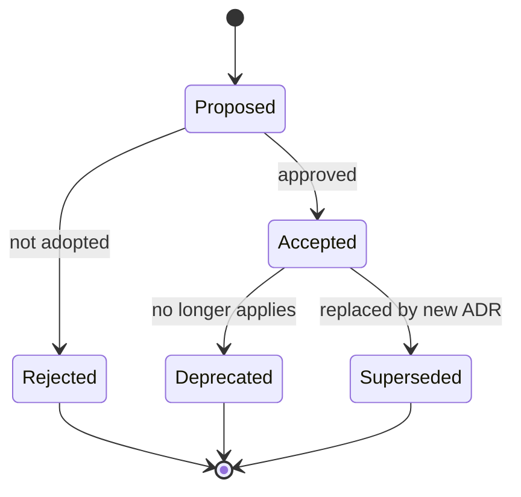

# Architecture Decision Records

Architecture decisions for the Mobile Markdown Viewer, captured as
numbered, immutable records using a reduced MADR format.

## Status Lifecycle



Accepted ADRs are never edited except to change status. A new decision
supersedes an old one with a new ADR.

## Index

| # | Title | Status |
|---|-------|--------|
| [0001](0001-framework-flutter.md) | Use Flutter as the application framework | Accepted |
| [0002](0002-state-management-riverpod.md) | Riverpod for state management | Accepted |
| [0003](0003-navigation-go-router.md) | go_router for navigation | Accepted |
| [0004](0004-markdown-rendering.md) | Markdown rendering via `markdown` + `markdown_widget` | Accepted |
| [0005](0005-mermaid-rendering.md) | Mermaid via sandboxed InAppWebView | Accepted |
| [0006](0006-math-rendering.md) | LaTeX math via `flutter_math_fork` | Accepted |
| [0007](0007-local-storage.md) | `drift` + `shared_preferences` for persistence | Accepted |
| [0008](0008-theming-material3.md) | Material 3 with dynamic color | Accepted |
| [0009](0009-platform-scope.md) | Target iOS + Android only for v1 | Accepted |
| [0010](0010-testing-strategy.md) | Layered testing strategy | Accepted |
| [0011](0011-network-access-policy.md) | Network access policy — user-initiated only | Accepted |
| [0012](0012-document-sync-architecture.md) | Document sync from public git repositories | Accepted |
| [0013](0013-codegen-ecosystem-alignment.md) | Align codegen ecosystem on Riverpod 3.x and freezed 3.x (updates ADR-0002) | Accepted |
| [0014](0014-logging-and-observability.md) | Logging, crash reporting, and observability | Accepted |

## Template

```markdown
# ADR-NNNN: <short decision>

- **Status**: Proposed | Accepted | Deprecated | Superseded by ADR-XXXX
- **Date**: YYYY-MM-DD
- **Deciders**: <names or roles>

## Context
<What problem are we solving? What forces are at play?>

## Decision
<What we decided, stated affirmatively.>

## Consequences

### Positive
- ...

### Negative
- ...

## Alternatives Considered

### <Alternative A>
<Why rejected>

### <Alternative B>
<Why rejected>
```
