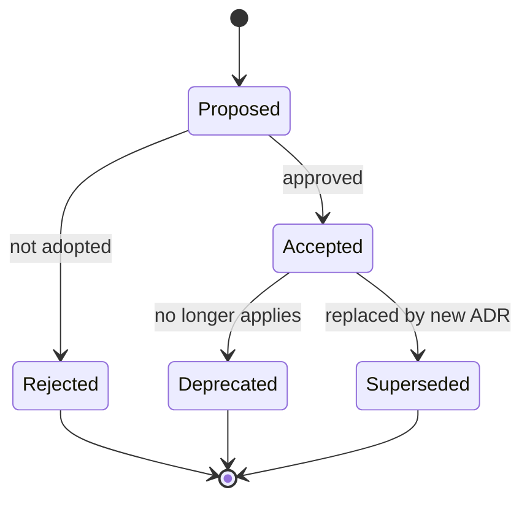

# Architecture Decision Records

Architecture decisions for the Mobile Markdown Viewer, captured as
numbered, immutable records using a reduced MADR format.

## Status Lifecycle


```mermaid
stateDiagram-v2
    [*] --> Proposed
    Proposed --> Accepted: approved
    Proposed --> Rejected: not adopted
    Accepted --> Deprecated: no longer applies
    Accepted --> Superseded: replaced by new ADR
    Rejected --> [*]
    Deprecated --> [*]
    Superseded --> [*]
```

Accepted ADRs are never edited except to change status. A new decision
supersedes an old one with a new ADR.

## Index

| # | Title | Status |
|---|-------|--------|
| [0001](0001-framework-flutter.md) | Use Flutter as the application framework | Accepted |
| [0002](0002-state-management-riverpod.md) | Riverpod for state management | Accepted |
| [0003](0003-navigation-go-router.md) | go_router for navigation | Accepted |
| [0004](0004-markdown-rendering.md) | Markdown rendering via `markdown` + `markdown_widget` | Accepted |
| [0005](0005-mermaid-rendering.md) | Mermaid via sandboxed InAppWebView | Superseded by ADR-0015 |
| [0006](0006-math-rendering.md) | LaTeX math via `flutter_math_fork` | Accepted |
| [0007](0007-local-storage.md) | `drift` + `shared_preferences` for persistence | Accepted |
| [0008](0008-theming-material3.md) | Material 3 with dynamic color | Accepted |
| [0009](0009-platform-scope.md) | Target iOS + Android only for v1 | Accepted |
| [0010](0010-testing-strategy.md) | Layered testing strategy | Accepted |
| [0011](0011-network-access-policy.md) | Network access policy — user-initiated only | Accepted |
| [0012](0012-document-sync-architecture.md) | Document sync from public git repositories | Superseded by ADR-0019 |
| [0013](0013-codegen-ecosystem-alignment.md) | Align codegen ecosystem on Riverpod 3.x and freezed 3.x (updates ADR-0002) | Accepted |
| [0014](0014-logging-and-observability.md) | Logging, crash reporting, and observability | Superseded by ADR-0020 |
| [0015](0015-mermaid-rendering-and-sandbox-v2.md) | Mermaid PNG rendering and sandbox policy v2 | Accepted |
| [0016](0016-platform-channel-contract-and-native-io.md) | Versioned platform-channel contract and native I/O execution | Accepted |
| [0017](0017-local-content-storage-and-cache-lifecycle.md) | Local content storage, cache lifecycle, and portable restore | Accepted |
| [0018](0018-failure-taxonomy-and-boundary-semantics.md) | Failure taxonomy and boundary semantics | Accepted |
| [0019](0019-repository-sync-execution-and-integrity.md) | Repository sync execution, integrity, and resumability | Accepted |
| [0020](0020-observability-privacy-and-release-activation.md) | Privacy-safe observability and release activation | Accepted |
| [0021](0021-document-export-sharing-and-external-links.md) | Document export, sharing, and external links | Accepted |
| [0022](0022-search-architecture.md) | Search architecture and rendered-text mapping | Accepted |
| [0023](0023-math-delimiter-semantics.md) | Currency-safe markdown math delimiters | Accepted |
| [0024](0024-platform-support-and-responsive-layout.md) | Platform support and responsive layout | Accepted |
| [0025](0025-codegen-lint-and-toolchain-maintenance.md) | Codegen, Riverpod lint, and toolchain maintenance | Accepted |
| [0026](0026-risk-scoped-integration-and-performance-gates.md) | Risk-scoped CI quality gates | Accepted |
| [0027](0027-performance-measurement-tiers.md) | Reference-device and hosted performance contracts | Accepted |

## Metadata and Relationships

New ADRs use the following metadata in this order:

- `Status`
- `Date`
- `Deciders`
- `Owner`
- `Revisit date`
- relationship fields, when applicable

Relationship fields have these meanings:

- `Supersedes` / `Supersedes if accepted`: replaces all or an explicitly named
  part of an existing decision.
- `Amends` / `Amends if accepted`: changes a named rule without replacing the
  rest of the existing decision.
- `Extends`: adds a compatible decision within the scope of an existing ADR.
- `Depends on`: cannot be implemented correctly before the referenced decision.
- `Related`: provides relevant context without a hard dependency.

A proposed ADR uses conditional wording for `Supersedes` and `Amends`. After
acceptance, the proposal's status and relationship wording are updated and the
replaced ADR's status changes to `Superseded by ADR-NNNN` when the replacement is
complete. Accepted legacy ADRs are not rewritten solely to adopt this schema.

## Template

```markdown
# ADR-NNNN: <short decision>

- **Status**: Proposed | Accepted | Deprecated | Superseded by ADR-XXXX
- **Date**: YYYY-MM-DD
- **Deciders**: <names or roles>
- **Owner**: <person or role>
- **Revisit date**: YYYY-MM-DD
- **Supersedes if accepted**: [ADR-XXXX](XXXX-title.md), in full or named part
- **Amends if accepted**: [ADR-XXXX](XXXX-title.md), named rule
- **Extends**: [ADR-XXXX](XXXX-title.md)
- **Depends on**: [ADR-XXXX](XXXX-title.md)
- **Related**: [ADR-XXXX](XXXX-title.md)

## Context
<What problem are we solving? What forces are at play?>

## Decision
<What we decided, stated affirmatively.>

## Consequences

### Positive
- ...

### Negative
- ...

## Alternatives Considered

### <Alternative A>
<Why rejected>

### <Alternative B>
<Why rejected>
```

Omit relationship fields that do not apply.
