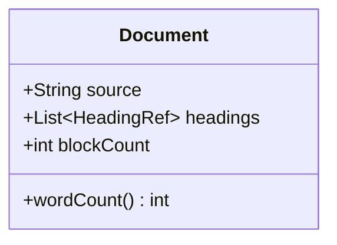
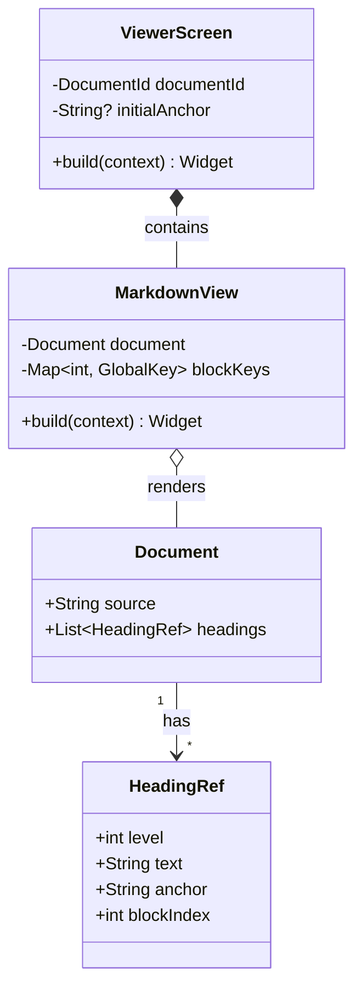
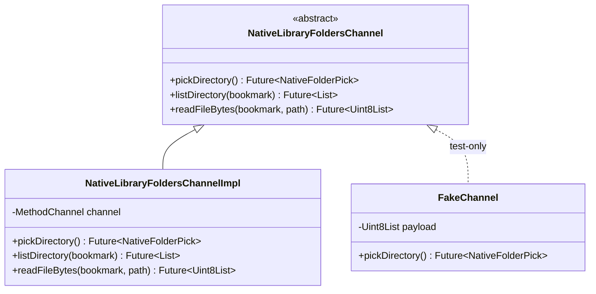
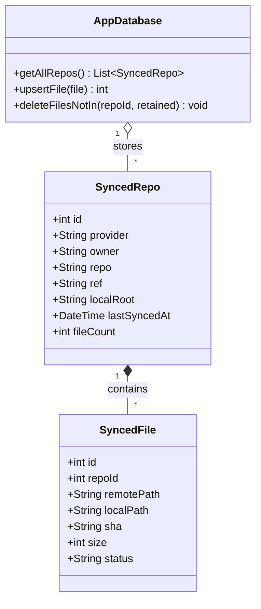
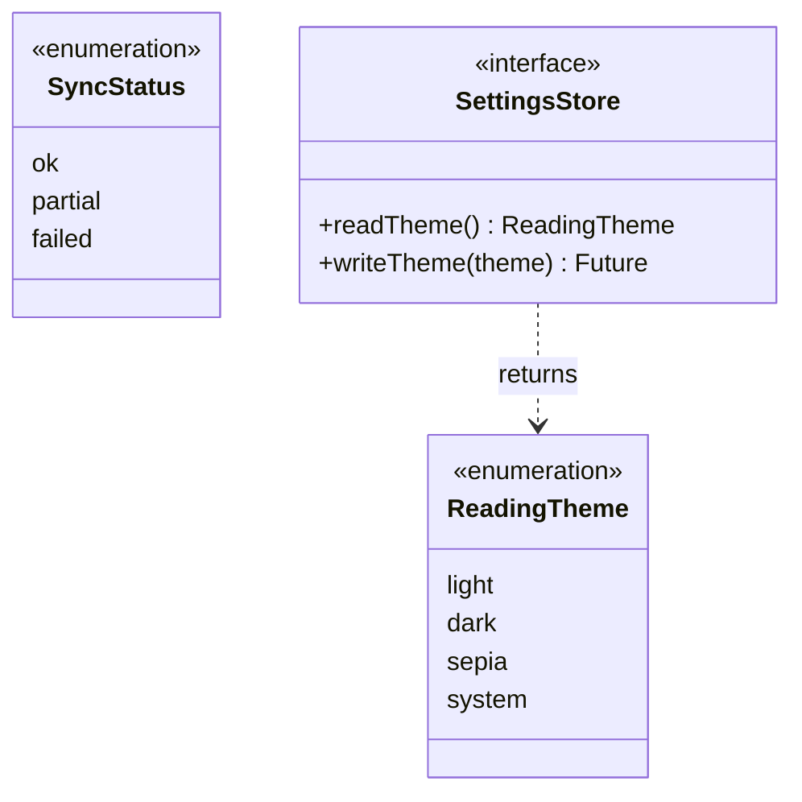

# Mermaid — class diagrams

Class diagrams capture the static structure of a system: types,
their fields and methods, and the relationships between them.

## Basic class

## Relationships

## Inheritance and interfaces

## Composition with cardinality

## Enumerations

