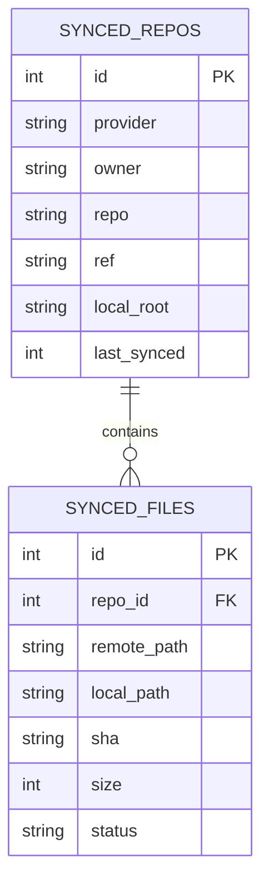
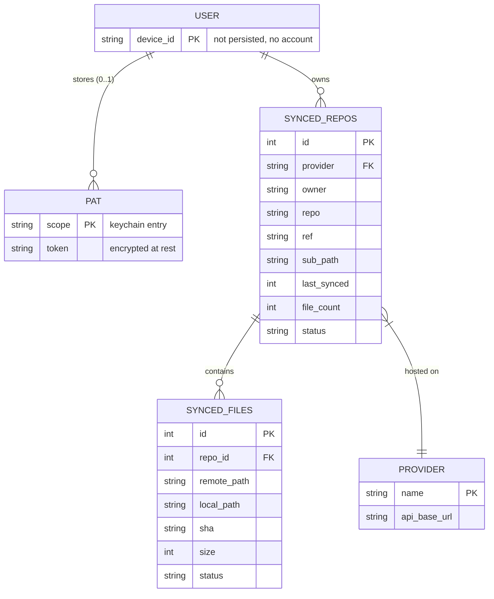
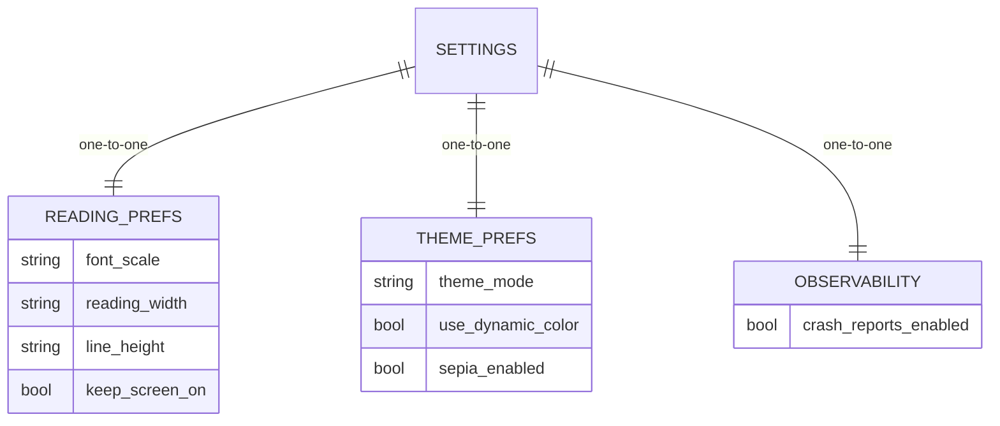

# Mermaid — entity-relationship diagrams

ER diagrams model data structure: entities, their attributes, and
the relationships (one-to-one, one-to-many, many-to-many) between
them.

## Basic relationship

## Multi-table schema

## Cardinality reference

Mermaid uses a shorthand for the two ends of a relationship line:

| Notation | Meaning        |
|----------|----------------|
| `\|\|`   | exactly one    |
| `o\|`    | zero or one    |
| `\|{`    | one or more    |
| `o{`     | zero or more   |

So `SYNCED_REPOS ||--o{ SYNCED_FILES` reads as "each repo has zero
or more files, and each file belongs to exactly one repo."

## Preferences table

