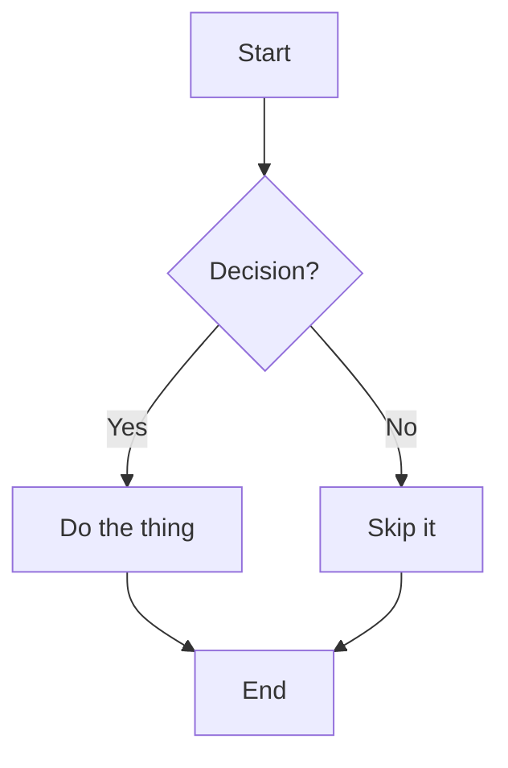
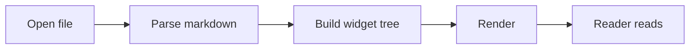
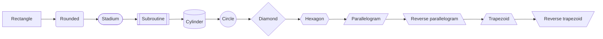
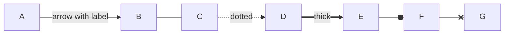
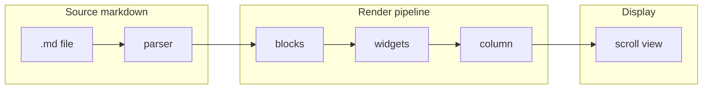
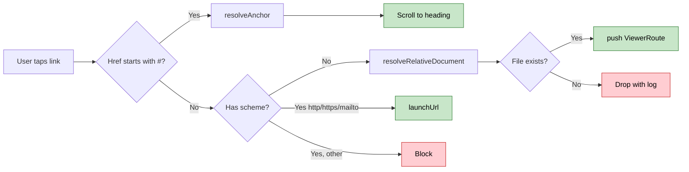

# Mermaid — flowcharts

Flowcharts visualise processes, state transitions, and control flow.
The viewer renders every mermaid block inside a sandboxed WebView and
caches the result per-diagram so re-scrolling a document does not
re-render.

## Top-to-bottom

## Left-to-right

## Node shapes

## Edge types

## Subgraphs

## With styling

