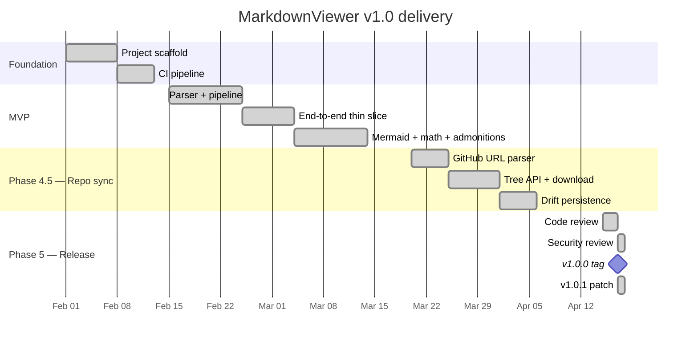
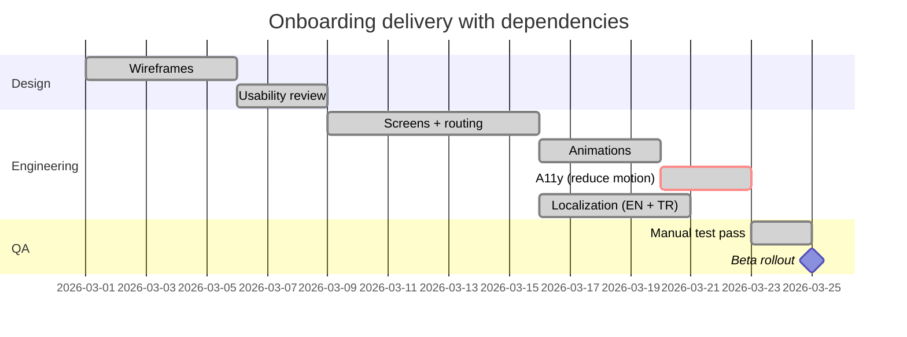

# Mermaid — Gantt charts

Gantt charts plot work over time: sequential tasks, parallel tracks,
milestones, and dependencies.

## Release timeline

## Parallel tracks

```mermaid
gantt
    title Release pipeline — parallel platform jobs
    dateFormat HH:mm
    axisFormat %H:%M

    section Shared
    Checkout + deps       :done, s1, 00:00, 2m
    Verify (lint/test)    :done, s2, after s1, 4m

    section Android
    Keystore decode       :done, a1, after s2, 10s
    Build signed AAB      :done, a2, after a1, 5m
    Upload Play Console   :done, a3, after a2, 40s

    section iOS
    Xcode setup           :done, i1, after s2, 30s
    Cert + profile        :done, i2, after i1, 20s
    Build signed IPA      :done, i3, after i2, 9m
    Upload TestFlight     :done, i4, after i3, 1m

    section Release
    GitHub Release        :done, r1, after a3, 30s
```

## With milestones and critical tasks

