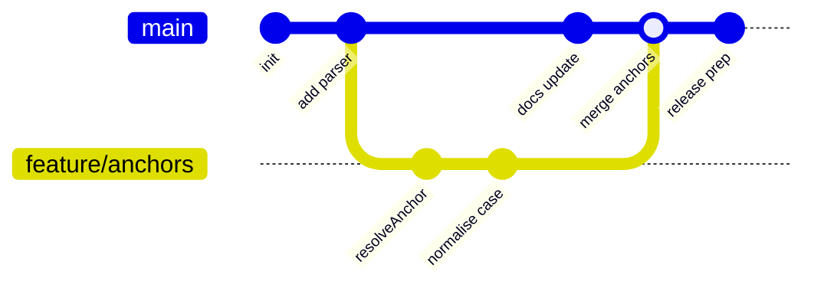
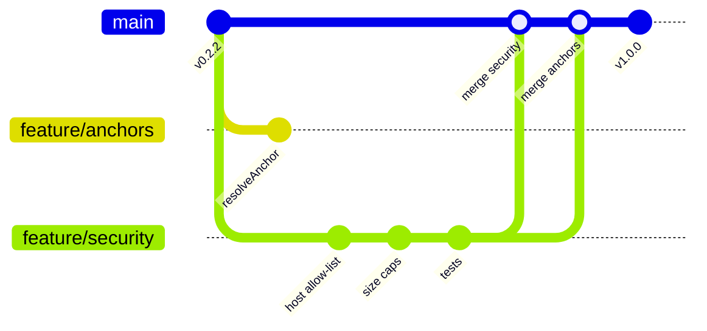
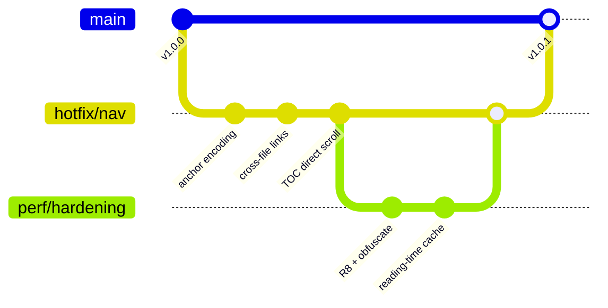
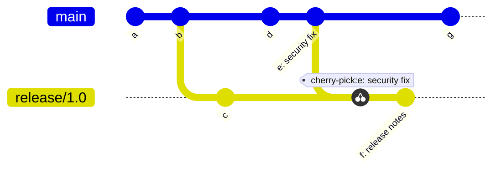

# Mermaid — git graphs

Git graphs visualise branch topology: commits, branches, merges,
cherry-picks. Helpful for explaining a non-trivial branching
strategy or a past merge decision.

## Simple feature branch

## Concurrent feature branches

## Release train

## Cherry-picks

