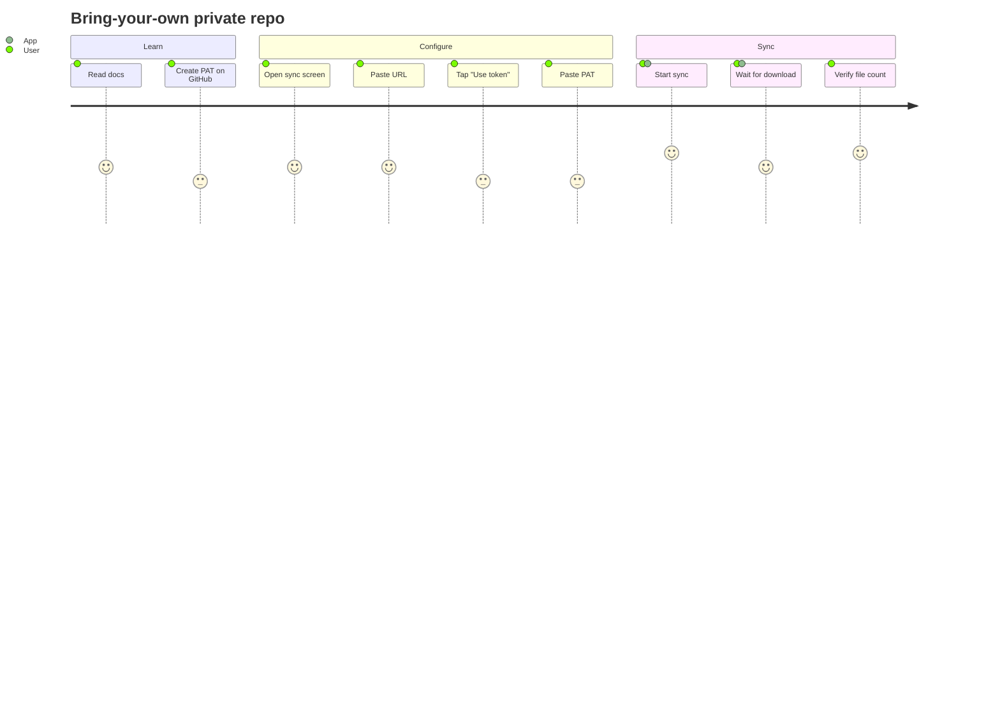
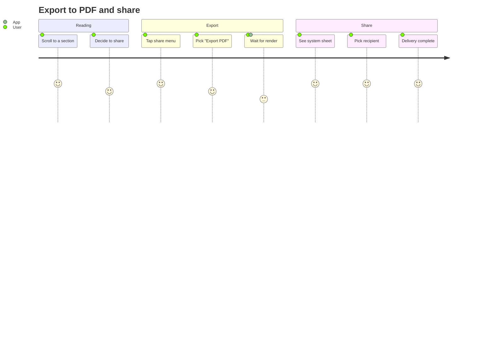
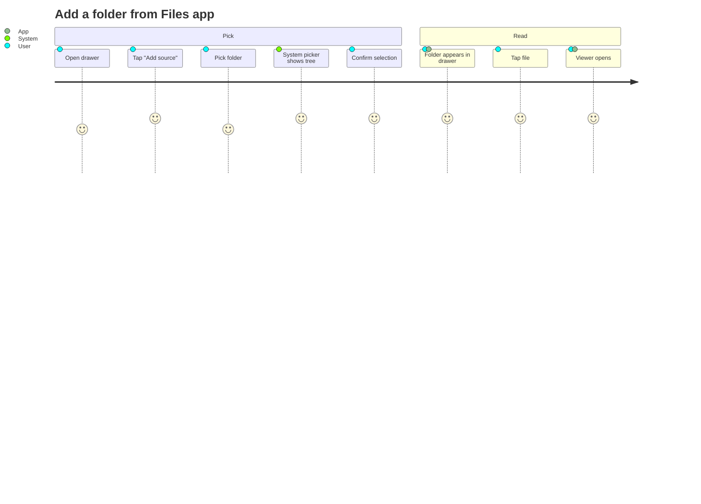

# Mermaid — user journey

User journey diagrams map the emotional arc of an interaction step
by step. Each task on a row gets a score (1–5) and an optional
actor. Useful for UX reviews where you want to see at a glance
which steps are friction and which are delight.

## First-time sync

## Private repo setup

## Share a document out

## Adding a local folder

