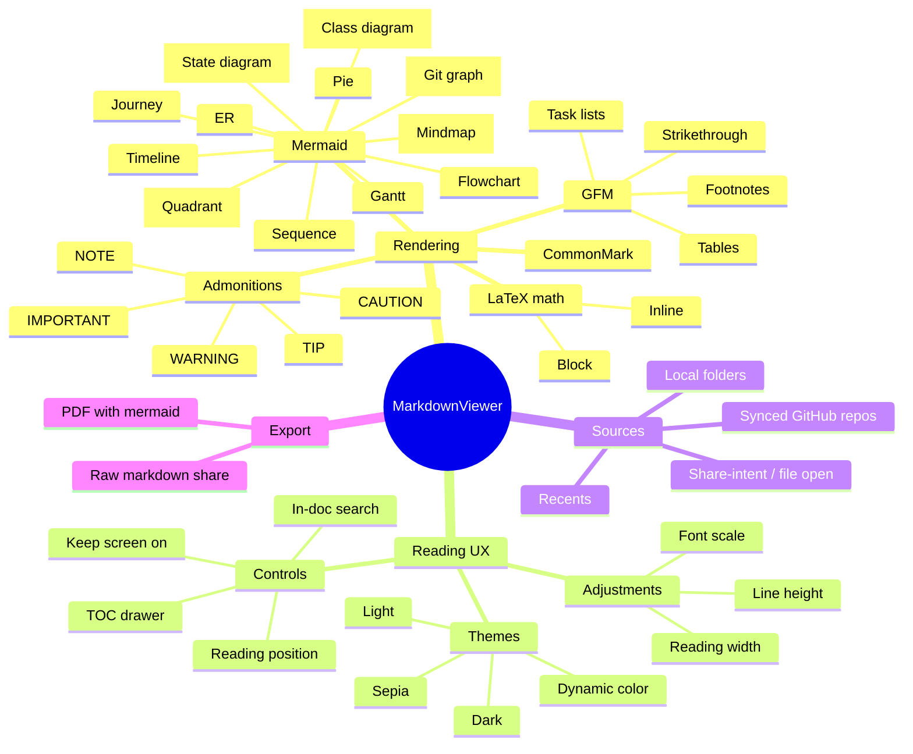
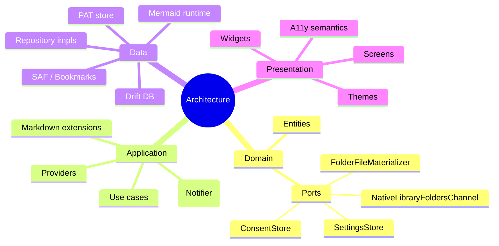
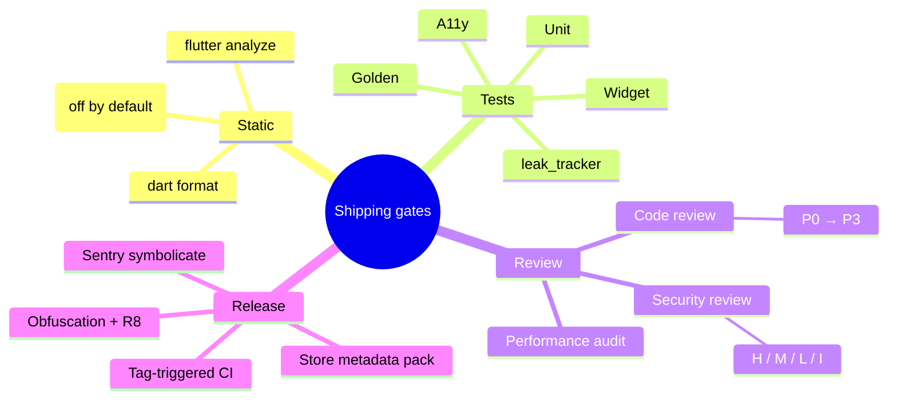

# Mermaid — mindmaps

Mindmaps branch outward from a single root topic. Indentation
determines depth; syntax is minimal (just nested topic names).

## Feature overview

## Architecture layers

## Quality gates

