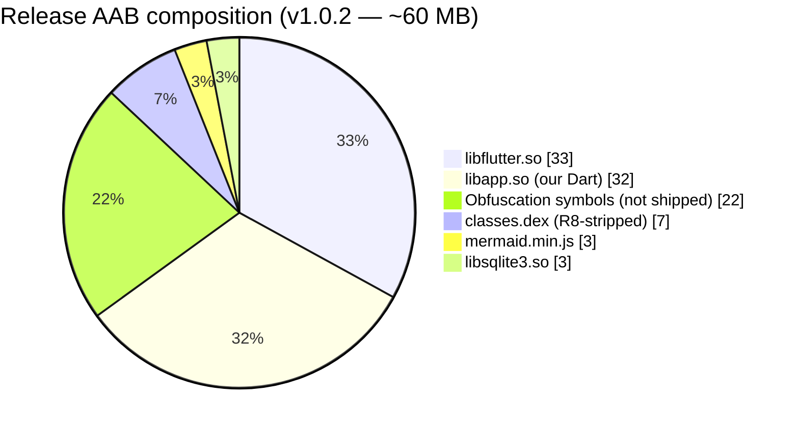
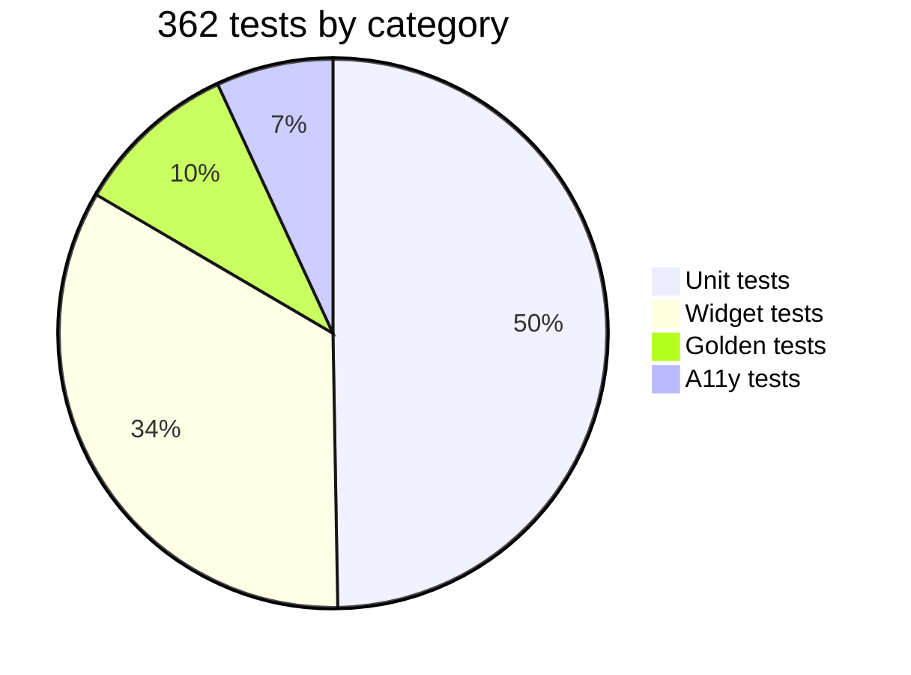
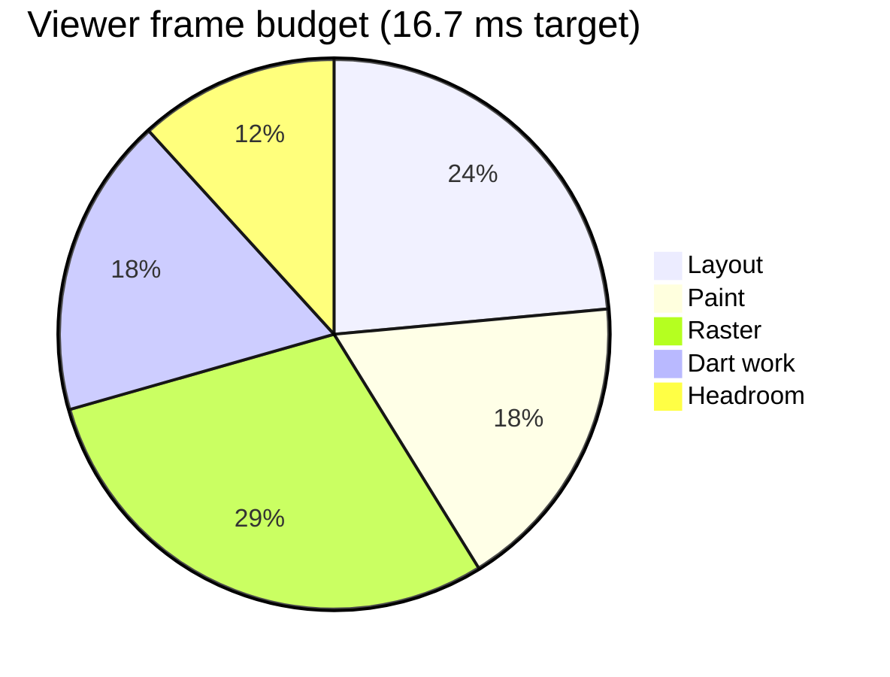
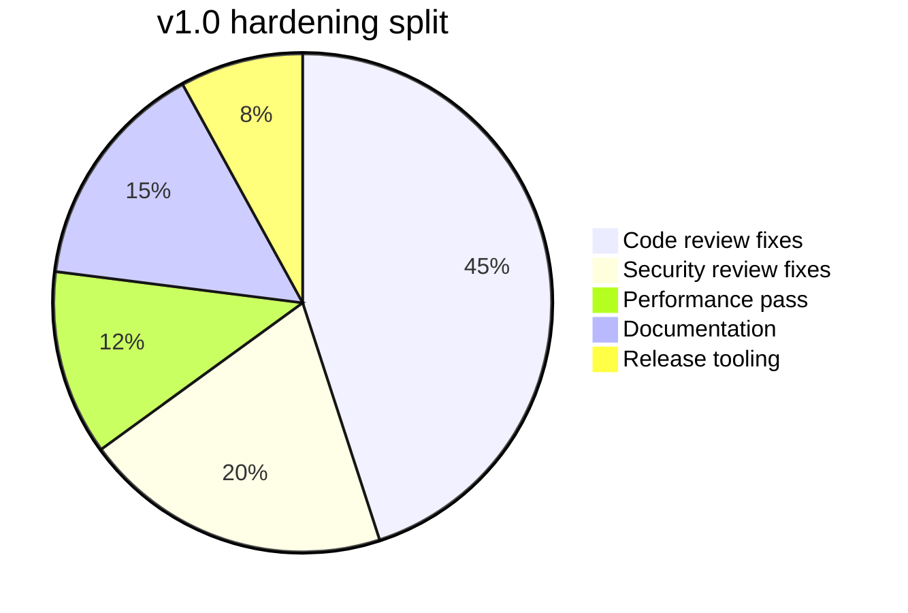

# Mermaid — pie charts

Pie charts are a quick way to show relative proportions — useful
for "how is this budget split?" storytelling where exact numbers
matter less than the distribution.

## Build artifact size

## Test distribution

## Performance budget allocation

## Phase 5 work breakdown

