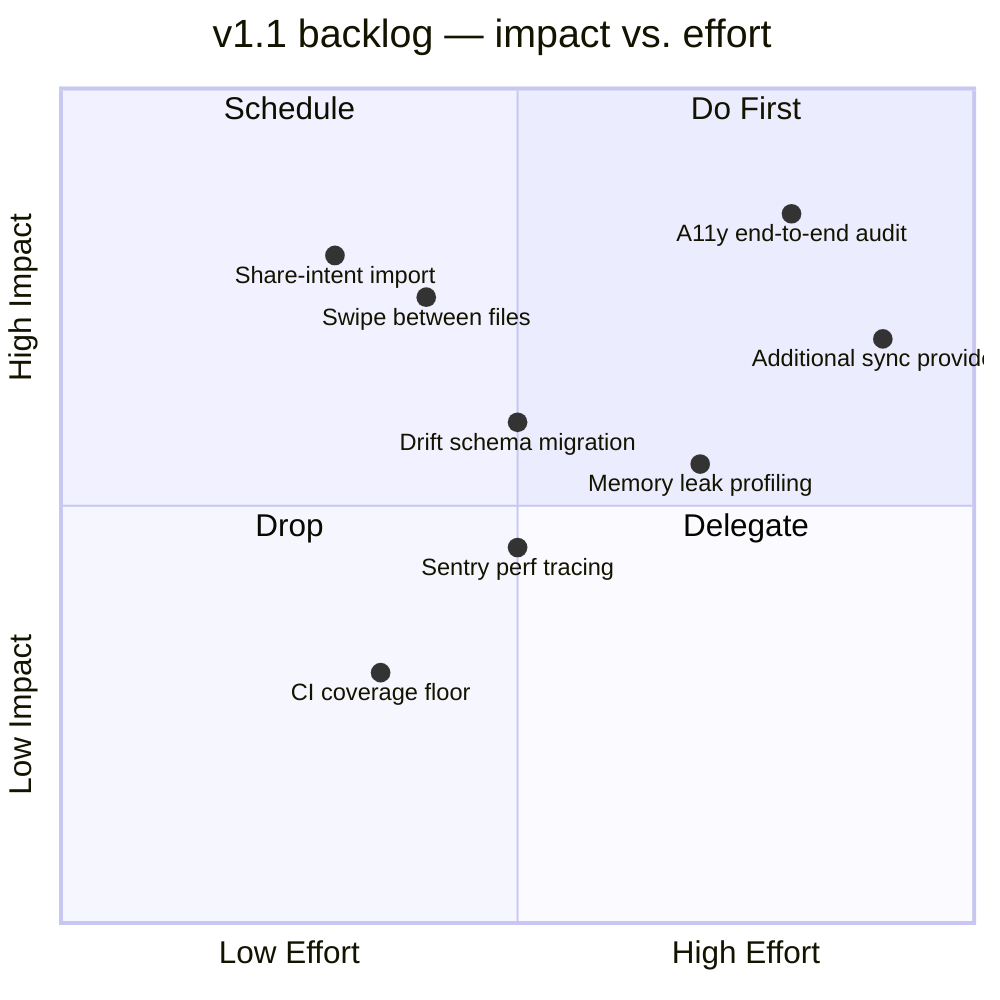
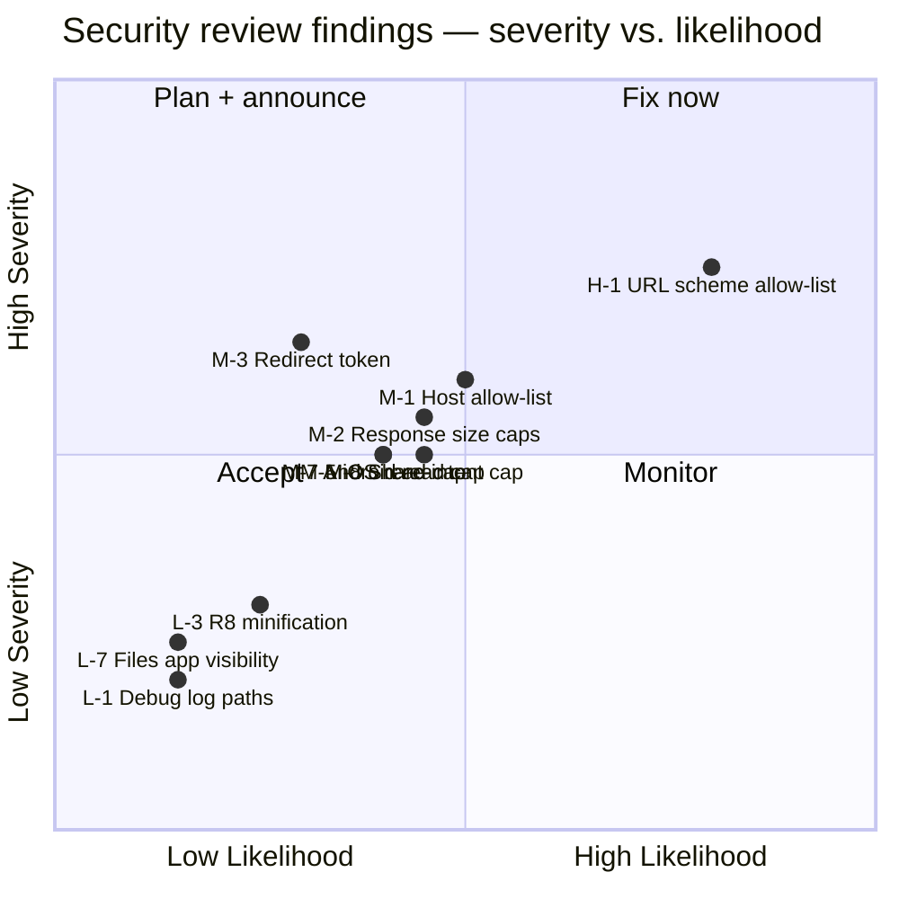
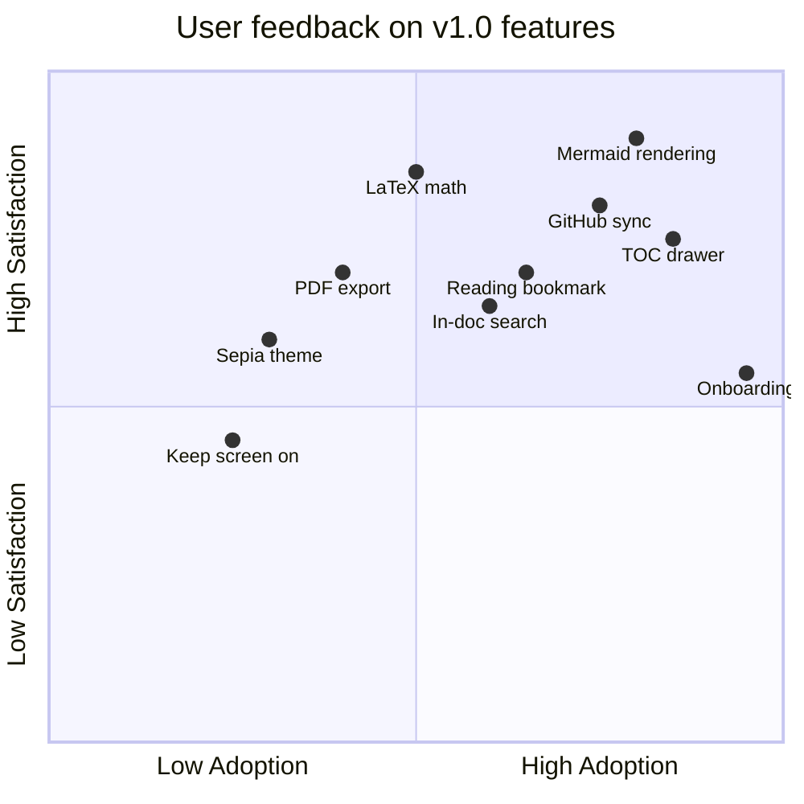

# Mermaid — quadrant charts

Quadrant charts plot items on two axes, categorising them into four
quadrants — classic for prioritisation (impact vs. effort,
importance vs. urgency) and risk matrices.

## Impact / effort for v1.1 backlog

## Security findings triage

## Feature reception grid

