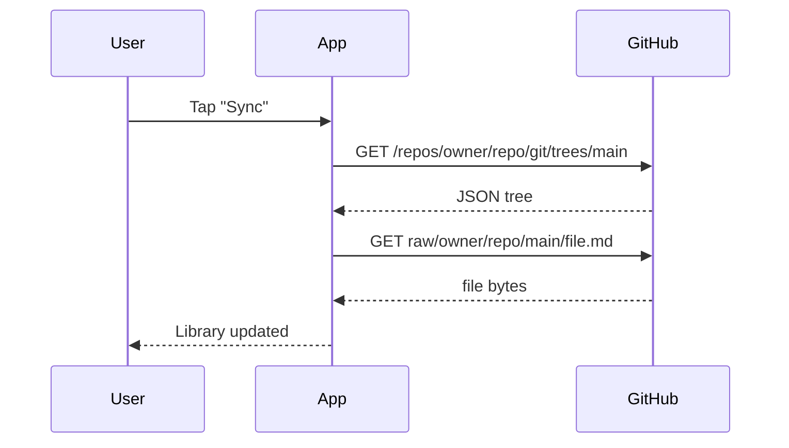
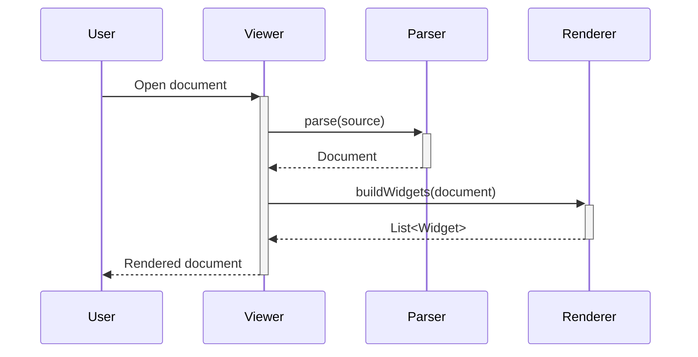
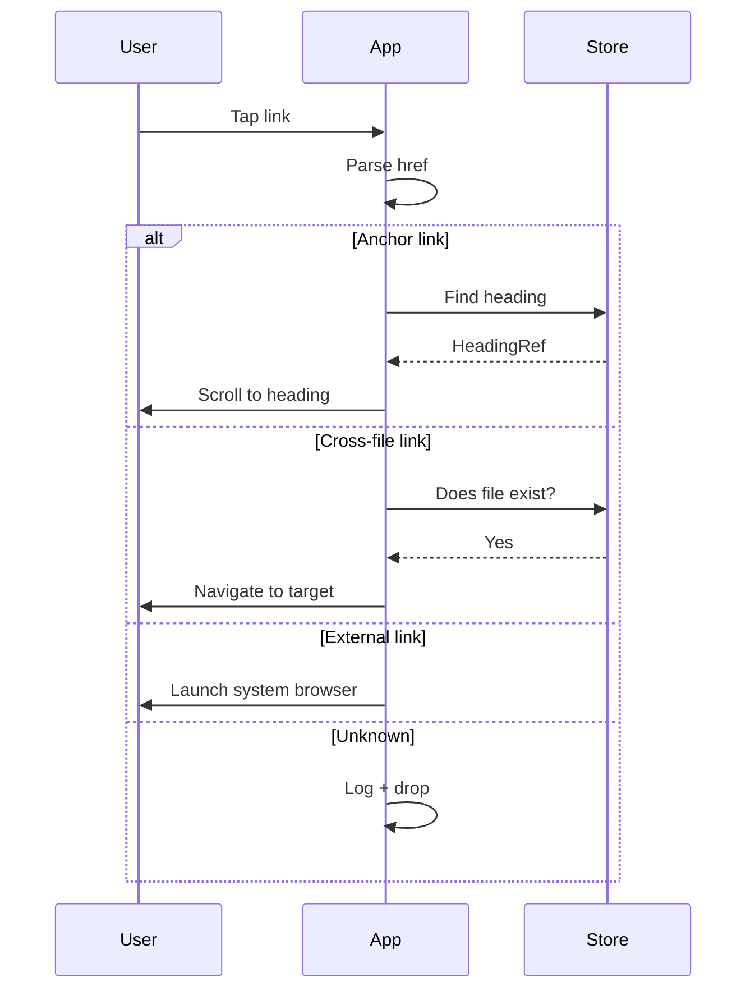
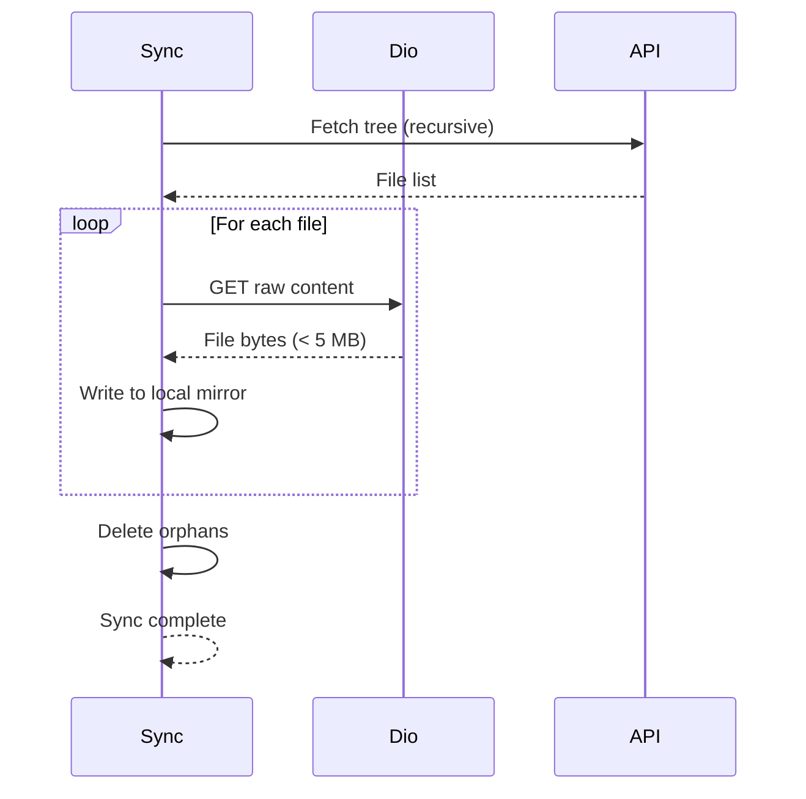
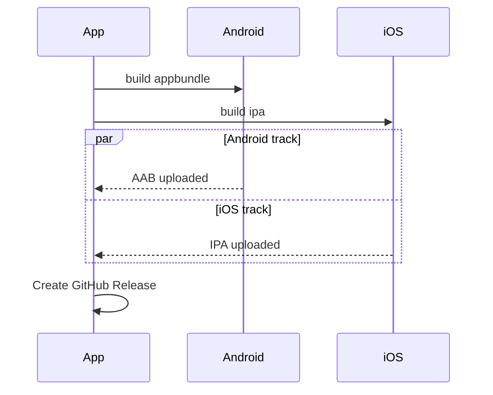
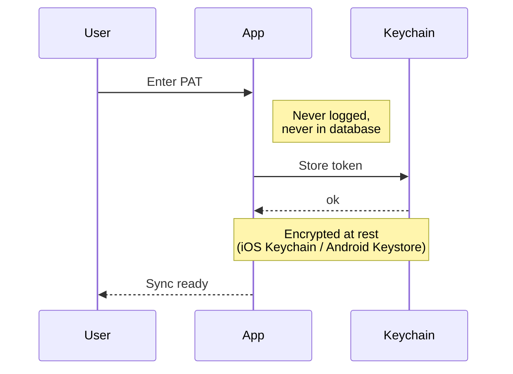

# Mermaid — sequence diagrams

Sequence diagrams trace the lifecycle of a request across
participants over time.

## Simple request / response

## With activation bars

## Alternative paths

## Looping interaction

## Parallel activities

## Notes

