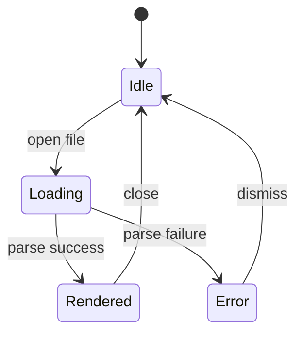
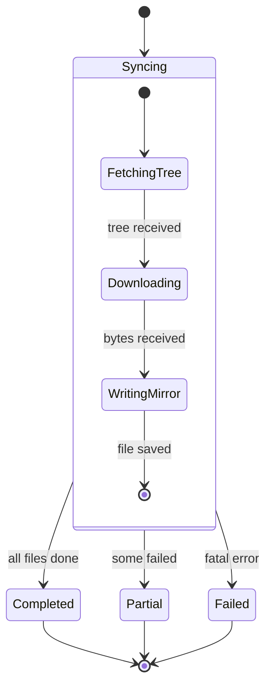
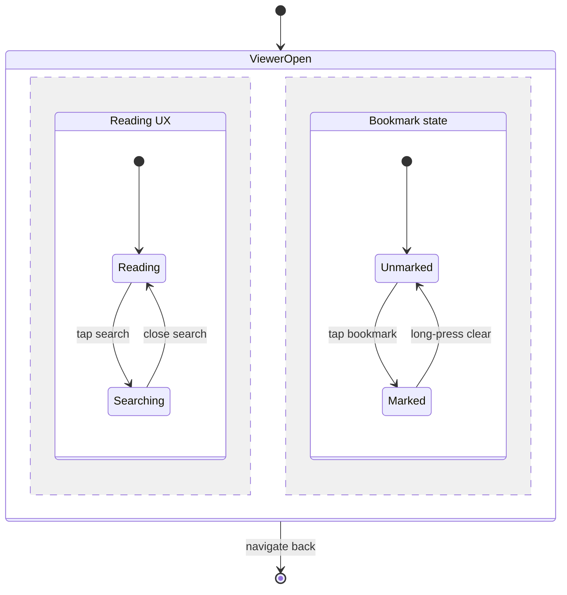
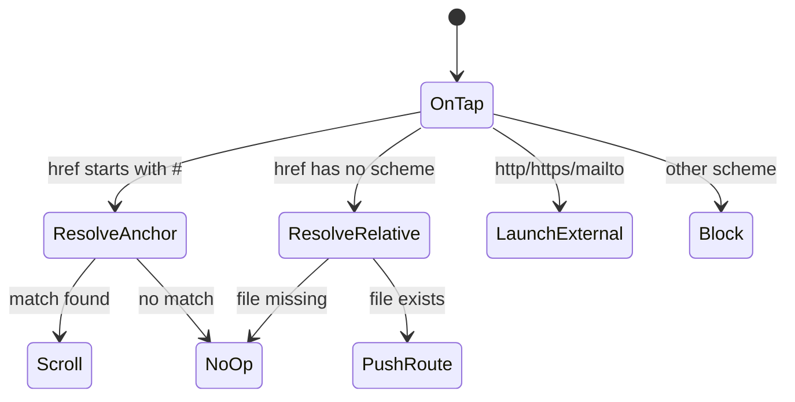
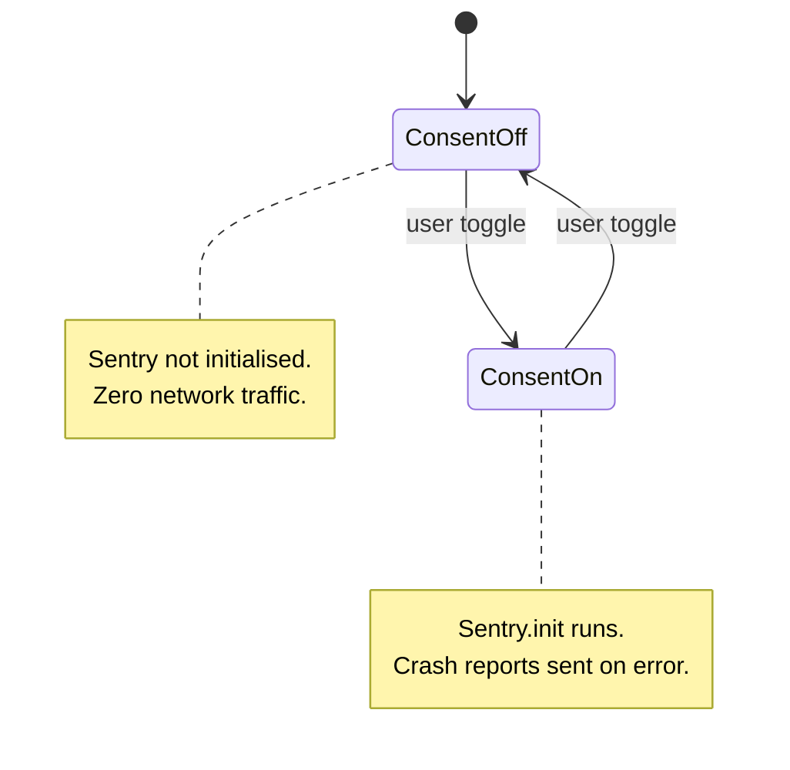

# Mermaid — state diagrams

State diagrams model behaviour — what states a system can be in and
which transitions are legal between them.

## Basic state machine

## Nested (composite) states

## Parallel regions

## Decision with guards

## Notes on states

