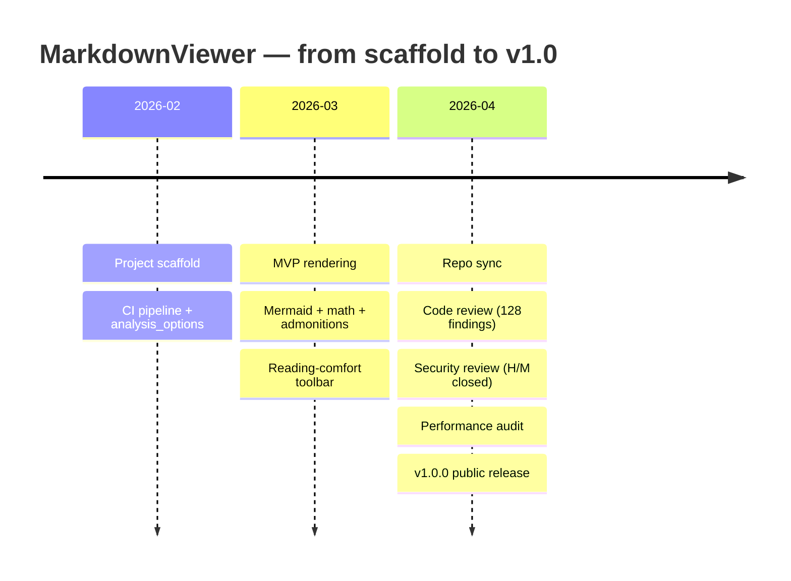
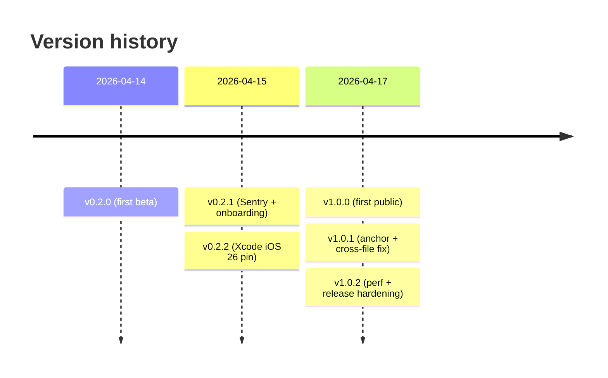
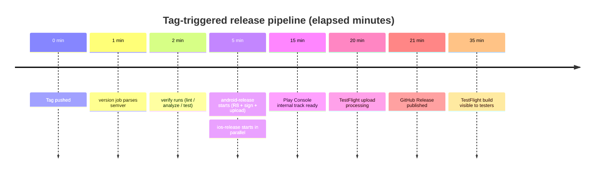

# Mermaid — timelines

Timelines chart events across calendar time. Each section rolls up
into a heading; each entry is a point on the line.

## Project delivery

## Changelog at a glance

## Day-in-the-life of a release

The timeline syntax uses `:` as the section-to-event separator, so
an entry label like `T+00:00` would be ambiguous. We reach for
plain-English minute labels instead.

