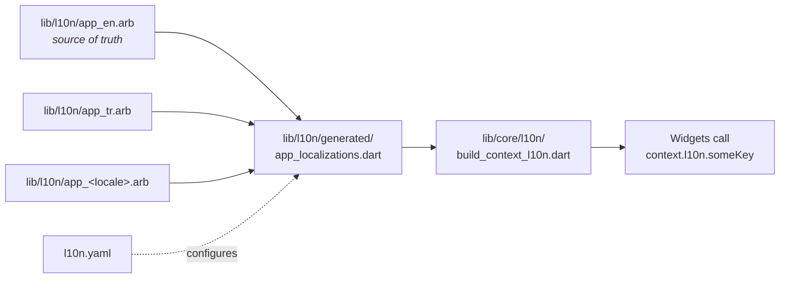

# How to Add a New Language

This guide describes how to add a new locale to the Mobile Markdown Viewer.
The i18n stack uses `flutter_localizations` + `intl` with ARB source files
under `lib/l10n/`. See
[../standards/localization-standards.md](../standards/localization-standards.md)
for the binding rules.

## Time Required

Approximately 10 minutes of mechanical work, plus the translation pass
itself.

## Prerequisites

- The locale code you want to add (BCP 47), e.g. `de` for German,
  `fr-CA` for Canadian French, `pt-BR` for Brazilian Portuguese
- A translation pass on every key currently in `lib/l10n/app_en.arb`
- Flutter SDK ≥ 3.41 installed and `flutter pub get` already run for the
  project

## File Layout



## Steps

### 1. Create the ARB file

Copy the English source file to a new file named for the locale:

```bash
cp lib/l10n/app_en.arb lib/l10n/app_de.arb
```

### 2. Update the locale header

At the top of the new file, change the `@@locale` value to match the
locale code in the filename:

```json
{
  "@@locale": "de",
  "appTitle": "Markdown Viewer",
  ...
}
```

### 3. Translate every value

- Translate **every** string value
- Do **not** delete the `@key` description blocks — translators rely on
  them for context. Description blocks live only in the English source
  file; secondary locales contain values only.
- Keep ICU plural and select syntax intact:
  `{count, plural, =0{...} =1{...} other{...}}`
- Keep placeholder names unchanged: `{name}` stays `{name}`
- Respect the `1.3×` text expansion rule from the localization standard —
  if a translated string is much longer than the English source, verify
  the affected screen does not overflow

### 4. Regenerate the localization classes

From the project root:

```bash
flutter gen-l10n
```

This produces updated files under `lib/l10n/generated/`. The generated
class `AppLocalizations` automatically picks up the new locale.

The same generation runs as part of `flutter run` and `flutter build`,
so this step is only needed when you want to verify locally without a
full build.

### 5. (Optional) Add to the in-app language picker

If you want this locale to appear in **Settings → Language**, add it to
the `preferred-supported-locales` list in `l10n.yaml`:

```yaml
preferred-supported-locales:
  - en
  - tr
  - de
```

If you skip this step, Flutter will still match the locale automatically
when the user's device language is set to it, but it will not be selectable
from inside the app.

### 6. Add a completeness test

Add or update the linguistic-completeness test in
`test/unit/l10n/locale_completeness_test.dart` so CI verifies that the
new ARB file has the same key set as `app_en.arb`. The test should fail
loudly when keys are missing or extra.

### 7. Verify in the app

Run the app and switch language from **Settings → Language** (or change
the device language). Confirm:

- Every screen renders translated text
- No clipping or overflow at the system maximum font scale
- Plurals work for `0`, `1`, `2`, `11` (locale-specific plural rules)
- Long strings still fit within their containers

### 8. Open a PR

Follow [git-workflow-standards](../standards/git-workflow-standards.md)
and label the PR with `i18n`. The PR description should list the locale
code and the translator, if applicable.

## Adding a Key (in Any Language)

When you need a new user-facing string:

1. Add the new key to `lib/l10n/app_en.arb` as the **source of truth**,
   with a `@key` description block that explains the context for translators
2. Add a translation to **every** other `app_<locale>.arb` file (the
   completeness test fails otherwise)
3. Run `flutter gen-l10n` (or just `flutter run`)
4. Use the key from any widget via the context extension:

```dart
import 'package:markdown_viewer/core/l10n/build_context_l10n.dart';

Text(context.l10n.actionOpenFile)
```

## Troubleshooting

**`AppLocalizations` is `null` at runtime**
You forgot to register the localization delegates on `MaterialApp`. Add:

```dart
MaterialApp(
  localizationsDelegates: AppLocalizations.localizationsDelegates,
  supportedLocales: AppLocalizations.supportedLocales,
  ...
)
```

**`flutter gen-l10n` says "ICU syntax error"**
Open the offending ARB file and check for unbalanced braces in plural or
select expressions. The ICU parser is strict about whitespace inside
braces.

**A new key is missing in some locales**
That is what the completeness test catches. Run `flutter test
test/unit/l10n/locale_completeness_test.dart` locally and add the
missing translations.
