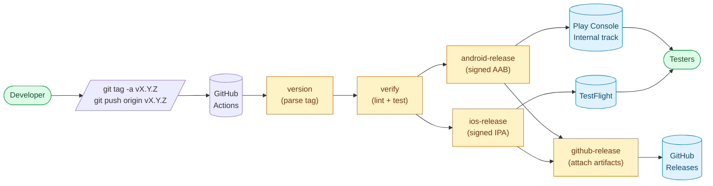
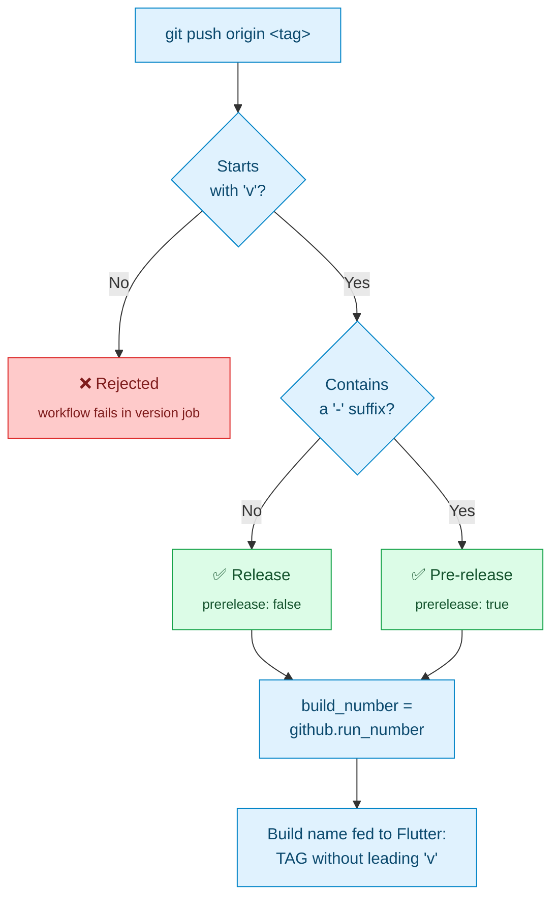
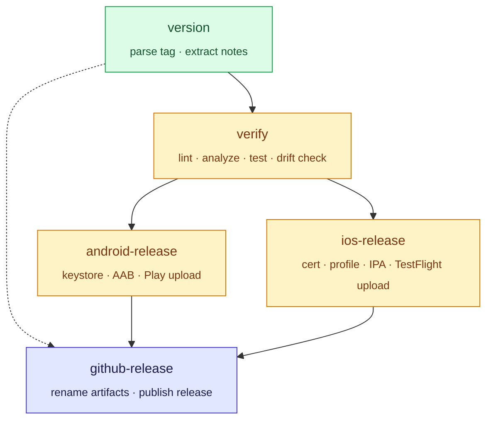
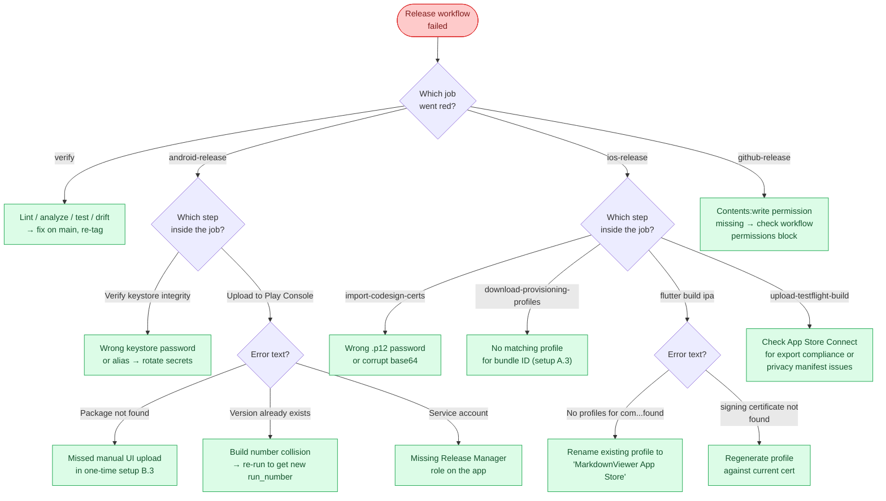

# Release process

This document describes how MarkdownViewer ships a production build to
**TestFlight** (iOS) and **Google Play Console → Internal track**
(Android). The entire pipeline is implemented in
[`.github/workflows/release.yml`](../.github/workflows/release.yml)
and fires automatically when a tag matching `v*` is pushed.

## Pipeline at a glance



The whole pipeline is gated on a single action: pushing an annotated
tag. Everything else — version extraction, re-verification, signed
builds, store uploads, artifact publishing — happens automatically
in ~20 minutes. The rest of this document covers the one-time setup
that makes the above diagram runnable.

---

## TL;DR — cutting a release

Once the one-time setup below is done, shipping a new build is two
commands:

```bash
# 1. Write the annotated tag (the message becomes the release notes).
git tag -a v1.2.3 -m "What changed in this release:
- First bullet
- Second bullet
- Third bullet"

# 2. Push the tag. This starts the pipeline.
git push origin v1.2.3
```

Watch the run at
`https://github.com/<owner>/MarkdownViewer/actions`. When all four
jobs are green:

- **iOS:** the build appears under
  [App Store Connect → TestFlight](https://appstoreconnect.apple.com/)
  within 10–15 minutes of the `ios-release` job finishing (Apple
  processing delay, not a workflow bug). Add internal testers and
  they can install via the TestFlight app.
- **Android:** the build lands in
  [Play Console → Release → Testing → Internal testing](https://play.google.com/console/)
  immediately. Internal testers on the allow-list can install from
  their opt-in URL. To ship to real users, promote the internal
  release to the **Closed testing → Production** tracks manually
  from the Play Console UI.
- **GitHub:** a new release appears on the
  [Releases page](https://github.com/) with the `.aab` and `.ipa`
  attached under a version-suffixed filename.

---

## Tag format

### Validation rules



### Examples

The workflow only accepts tags of the form `vX.Y.Z`, with an
optional pre-release suffix:

| Tag             | Treated as   | Version string fed to Flutter |
| --------------- | ------------ | ----------------------------- |
| `v1.2.3`        | Release      | `1.2.3`                       |
| `v1.2.3-rc.1`   | Pre-release  | `1.2.3-rc.1`                  |
| `v0.1.0-beta`   | Pre-release  | `0.1.0-beta`                  |
| `1.2.3` (no v)  | **Rejected** | workflow fails fast           |

The **build number** fed to `CFBundleVersion` / `versionCode` is the
GitHub Actions run number, so re-tagging the same version after a
failed upload produces a higher build number than the last one the
stores saw — neither store rejects it as a duplicate.

Pre-release tags (anything with a `-` after the semver core) land
in the same track as production tags, but the GitHub Release is
marked `prerelease: true` so it does not appear under "Latest
release" on the repo landing page.

## Release notes

The workflow reads the **annotated tag message** (`git tag -a`) and
uses it for:

1. The Play Store Console "What's new" field on the internal track
   (truncated to 450 bytes to stay under Google's 500-char limit).
2. The GitHub Release body.
3. The TestFlight upload does **not** currently set release notes —
   testers see the last note left on the previous build. This can be
   added later via the App Store Connect API if it becomes annoying.

If you forget `-a` and push a lightweight tag, the workflow falls
back to a bulleted list of commit subjects between the previous tag
and this one, so the release still has *some* body.

**Best practice:** write the tag message as you would a release
announcement — a one-line summary followed by a bulleted list of
user-visible changes. Avoid internal jargon; this text ships to end
users on both stores.

---

## Required secrets

The workflow assumes that a collection of signing material and store
credentials has already been provisioned out-of-band and is available
as GitHub repository secrets. Populating these is a one-off chore
the project maintainer does before the first release; day-to-day
release operation (tagging, pushing, watching the pipeline go green)
does not require touching them again.

### Secret reference

Each row names a secret that `release.yml` reads, the origin of the
value, and where the workflow injects it.

#### iOS (5)

| Secret | Value | Consumed by |
|---|---|---|
| `IOS_DISTRIBUTION_CERT_BASE64` | base64 of the `.p12` Apple Distribution certificate exported from the maintainer's Keychain | `apple-actions/import-codesign-certs` step |
| `IOS_DISTRIBUTION_CERT_PASSWORD` | Password set when exporting the `.p12` | same step |
| `APPSTORE_ISSUER_ID` | UUID from App Store Connect → Users and Access | `download-provisioning-profiles` + `upload-testflight-build` |
| `APPSTORE_KEY_ID` | 10-char ID of the App Store Connect API key | same steps |
| `APPSTORE_PRIVATE_KEY` | Full text of the `.p8` API key file, including the `BEGIN`/`END` lines | same steps |

#### Android (5)

| Secret | Value | Consumed by |
|---|---|---|
| `ANDROID_KEYSTORE_BASE64` | base64 of the release `.keystore` used to sign the AAB | "Decode and stage release keystore" step |
| `ANDROID_KEYSTORE_PASSWORD` | Password for the keystore | signing config in `build.gradle.kts` |
| `ANDROID_KEY_ALIAS` | Alias of the key inside the keystore | signing config |
| `ANDROID_KEY_PASSWORD` | Password for the key itself (often identical to the keystore password) | signing config |
| `GOOGLE_PLAY_SERVICE_ACCOUNT_JSON` | Plain-text JSON blob from a Google Cloud service account with Play Console **Release Manager** role on this app | `r0adkll/upload-google-play` |

All ten are required; the workflow fails fast on the first missing
secret. Rotating any of them is a matter of updating the secret value
in `Settings → Secrets and variables → Actions` and re-running the
workflow — no config file in the repo references credential material
directly.

### First-time provisioning

Creating the signing material, registering bundle IDs, creating the
App Store Connect and Play Console app records, uploading a first
manual AAB, and generating the service account are a maintainer-only
one-off process. It is not part of the release workflow and is not
documented here — a fresh fork of this repo would need to repeat the
same bootstrap against its own Apple and Google accounts.

---

## Local debugging of signed builds

The `build.gradle.kts` release signing block reads from
`android/key.properties` before looking at environment variables, so
you can iterate on signing issues locally without CI:

```bash
# android/key.properties  (gitignored — never commit)
storeFile=/Users/you/secure/markdown-viewer-release.keystore
storePassword=...
keyAlias=markdown_viewer
keyPassword=...
```

Then:

```bash
flutter build appbundle --release
# → build/app/outputs/bundle/release/app-release.aab
flutter build ipa --release --export-options-plist=ios/ExportOptions.plist
# → build/ios/ipa/markdown_viewer.ipa
```

To test the Play Store upload step without cutting a real tag, run
`flutter build appbundle --release` locally and upload the resulting
bundle to Play Console manually. There is no way to test the
pipeline end-to-end without an actual tag push.

---

## What the workflow does, step by step

### Job dependency graph



`android-release` and `ios-release` run in parallel on different
runners (ubuntu-latest and macos-latest respectively) — the total
wall time is bounded by whichever platform is slower, which is
almost always iOS.

### Step list

1. **`version`** — parses the tag, extracts the semver string, and
   pulls release notes from the annotated tag message (or falls
   back to the commit log).

2. **`verify`** — re-runs lint, analyze, format check, build_runner
   + l10n drift checks, and the full test suite against the tag
   commit. This is the same battery as `ci.yml`'s lint-and-test job;
   it re-runs here because `ci.yml` is only wired to branch pushes
   and pull requests, not to tags.

3. **`android-release`** and **`ios-release`** run in parallel once
   `verify` is green:
   - Both jobs fetch the mermaid runtime, regenerate l10n, and run
     build_runner to match the `ci.yml` environment.
   - Android: decodes the keystore into `$RUNNER_TEMP`, validates it
     with `keytool -list`, writes the what's-new files, runs
     `flutter build appbundle`, and uploads to the Play Console
     internal track.
   - iOS: imports the distribution certificate into the runner's
     keychain, downloads the provisioning profile via the App Store
     Connect API, runs `flutter build ipa` against
     `ios/ExportOptions.plist`, and uploads to TestFlight.
   - Each job also saves its build artifact for the final job.

4. **`github-release`** — downloads both artifacts, renames them with
   the version suffix, and creates a GitHub Release using
   `softprops/action-gh-release`. Pre-release tags (with a `-`
   suffix) are flagged as pre-releases.

---

## Troubleshooting

### Quick decision tree

When a run fails, jump straight to the relevant section below:



### Android: `keytool -list` step fails

The `ANDROID_KEYSTORE_PASSWORD` or `ANDROID_KEY_ALIAS` secret is
wrong, or `ANDROID_KEYSTORE_BASE64` is corrupt. On macOS, re-encode
with `base64 -i markdown-viewer-release.keystore | pbcopy` (the `-i`
flag avoids the line wrapping that `-w0` requires on Linux).

### iOS: "No profiles for 'com.cemililik.markdownViewer' were found"

The `MarkdownViewer App Store` provisioning profile either does not
exist, is expired, or does not match the certificate currently stored
in `IOS_DISTRIBUTION_CERT_BASE64`. Go to
[Apple Developer → Profiles](https://developer.apple.com/account/resources/profiles/list),
regenerate the profile against the current cert, and re-run the
workflow (no secret changes needed — the workflow downloads the
profile fresh on every run).

### iOS: "Invalid provisioning profile. The certificate used to
### sign the profile is not included in the provisioning profile."

The distribution certificate was rotated but the provisioning profile
still references the old one. Regenerate the profile in the Apple
Developer portal.

### Play Store: "Package not found: com.cemililik.markdown_viewer"

You skipped one-time setup B.3 — Play Console requires the first
`.aab` to come through the UI, not the API. Upload a manual build
first, fill in the mandatory listing fields, and re-push the tag.

### TestFlight: build stuck in "Processing" state

Apple's processing step takes 5–15 minutes and is outside the
workflow's control. Wait. If it is still stuck after an hour, there
is usually a warning email from App Store Connect explaining why
(most commonly: missing export compliance declaration in Info.plist,
missing privacy manifest, or a forbidden `UIRequiredDeviceCapabilities`
entry).

### The release workflow runs but both platform jobs get skipped

The `verify` job failed. Open its log to see which check (format,
analyze, drift, tests) broke and fix it on `main` first, then
re-tag.

---

## Notes, out-of-scope items, future work

- **Production track promotion is manual.** The workflow only ships
  to the Play Store internal track. Promoting through Closed testing
  → Open testing → Production is a Play Console UI action, gated on
  whatever review and rollout schedule you want.
- **TestFlight external testing** also requires manual approval from
  Apple (review every time the version number changes). Internal
  testers on your team get the build instantly.
- **Release notes are English-only.** A future improvement would be
  to generate localized notes (TR/EN) either manually through two
  tag message sections or via a small AI call — for now both
  `whatsnew-en-US` and `whatsnew-tr-TR` get the same English copy.
- **No automatic version bumping.** You write the tag by hand, the
  workflow just reads it. If a PR changes user-visible behaviour,
  bumping the semver is part of that PR's responsibility.

---

## Protected `release` Environment

The two signing jobs (`android-release`, `ios-release`) declare
`environment: release` so the decrypted secrets only materialise
after an explicit approval. The Environment itself must exist in the
GitHub repository settings — a new clone / fork has to create it
once before any signed release can succeed.

Steps (one-time, repository admin):

1. GitHub → **Settings → Environments → New environment** →
   name `release`.
2. Enable **Required reviewers** and add the release maintainer(s).
3. Move every secret consumed by the signing / upload steps (see the
   inventory below) out of **Repository secrets** and into this
   Environment's **Environment secrets** tab. Secrets scoped to the
   Environment are invisible to workflows running outside it.

Without these three steps the workflow still runs but the signing
jobs sit on a "waiting for review" gate that no one can resolve.
Reference: security-review SR-20260419-002.

---

## Secret inventory

Every secret the release workflow consumes. Each row pairs the
consuming step with the rotation cadence so a departing maintainer
or a disclosure leaves a clear punch list.

| Secret | Consumed by | Rotate when |
|---|---|---|
| `ANDROID_KEYSTORE_BASE64` | `android-release` → Decode and stage release keystore | Keystore identity is fixed by Play Store signing policy — rotate only via Play App Signing's upload-key reset flow. |
| `ANDROID_KEYSTORE_PASSWORD` | `android-release` → Verify keystore integrity / Build signed app bundle | Annually, or immediately on disclosure. |
| `ANDROID_KEY_ALIAS` | same | Only on keystore reset. |
| `ANDROID_KEY_PASSWORD` | `android-release` → Build signed app bundle | Annually. |
| `GOOGLE_PLAY_SERVICE_ACCOUNT_JSON` | `android-release` → Upload to Play Console | Annually, and immediately on contributor departure (revoke in GCP IAM before re-minting). |
| `IOS_DISTRIBUTION_CERT_BASE64` | `ios-release` → Import distribution certificate | Annually — Apple's own cert has a ~1-year lifetime. |
| `IOS_DISTRIBUTION_CERT_PASSWORD` | same | Paired with the cert above. |
| `APPSTORE_ISSUER_ID` | `ios-release` → Download provisioning profiles / Upload to TestFlight | Stable; rotate only if the App Store Connect account is reprovisioned. |
| `APPSTORE_KEY_ID` | same | Paired with `APPSTORE_PRIVATE_KEY`. |
| `APPSTORE_PRIVATE_KEY` | same | Annually, and immediately on contributor departure. |
| `SENTRY_DSN` (optional) | `--dart-define` on both signing jobs | Only on project recreation. |

---

## Credential rotation

Expected cadences:

- **Annually** — iOS distribution cert, App Store Connect `.p8`, Play
  Service Account JSON, Android keystore passwords.
- **Immediately on contributor departure** — every secret the
  departing maintainer ever had access to. Revoke the upstream
  credential (GCP IAM, App Store Connect key list, Sentry member
  list) before re-minting the paste.
- **Immediately on disclosure** — treat a leak in a commit / log /
  screenshot as "secret burned"; rotate that row and audit
  downstream access.

Per-rotation procedure:

1. Revoke the old credential at the source. Revoking removes
   attacker access; updating GitHub first without revoking leaves
   the compromised token live.
2. Mint the replacement.
3. Paste into the `release` Environment's secret of the same name.
4. Kick off a release tag against a no-op commit to verify the
   workflow still reaches the "Upload to …" step.
5. Record the rotation date below.

Reference: security-review SR-20260419-024 / SR-20260419-049.

### Rotation log

_No rotations recorded yet. Start the log when the first rotation
lands._
