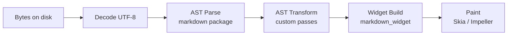
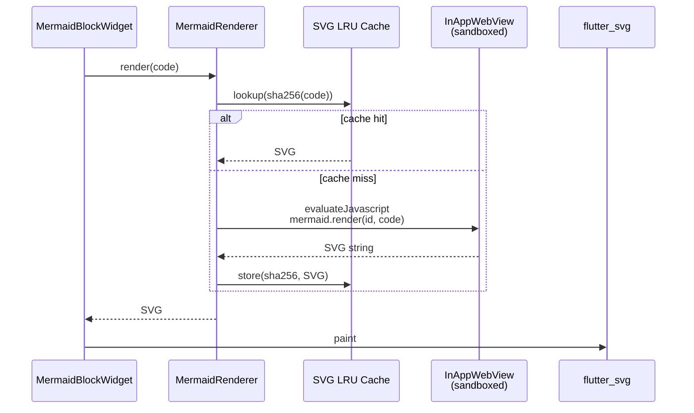

# Rendering Pipeline

End-to-end flow from a `.md` file on disk to pixels on screen.

## Stages

The full pipeline from disk bytes to painted pixels:



### Stage 1 — Decode

- Read file as bytes via `File.readAsBytes()`
- Detect BOM; fall back to UTF-8
- For documents larger than 200KB, perform remaining stages in an isolate
  via `compute()`

### Stage 2 — AST Parse

- Use the official Dart `markdown` package with a configured `Document`
- Enable extensions: GFM, tables, footnotes, inline-HTML (escaped)
- Register custom block syntaxes:
  - `MermaidBlockSyntax` — detects ` ```mermaid ` fenced blocks
  - `MathBlockSyntax` — detects `$$...$$` blocks
  - `AdmonitionSyntax` — detects `!!! note|warning|tip` blocks
- Output: `List<md.Node>`

### Stage 3 — AST Transform

Walk the AST to:

- Resolve relative image and link paths to absolute URIs against the
  document's base directory
- Build a `TableOfContents` from heading nodes
- Collect footnote definitions and references
- Normalize code-block language identifiers

### Stage 4 — Widget Build

Feed the AST into `markdown_widget` with a custom `MarkdownGenerator`.
Register custom node generators for:

- `code` → syntax-highlighted block via `re_highlight`
- `mermaid` → `MermaidBlockWidget`
- `math` → `flutter_math_fork` widget
- `admonition` → themed container

Images flow through `Image.file` / `Image.network` with disk-backed cache.

### Stage 5 — Paint

- Flutter's standard rendering pipeline
- Mermaid, math, and code blocks paint their own sub-trees

## Mermaid Rendering Sub-Pipeline

Mermaid is rendered via a sandboxed WebView with an SVG cache:



Strategy:

1. On app start, pre-warm a single hidden `InAppWebView` with bundled
   `mermaid.min.js` loaded from assets
2. For each mermaid block, call `mermaid.render(id, code)` via
   `evaluateJavascript`
3. Receive the SVG output as a string
4. Render the SVG via `flutter_svg` inline
5. Cache rendered SVG by `sha256(code)` in an in-memory LRU

**Security**: the WebView has no network access, no local file access,
and no JavaScript bridge beyond `mermaid.render`. See
[standards/security-standards.md](standards/security-standards.md).

## Code Highlighting Sub-Pipeline

1. Detect language from the fenced block info string
2. Look up the grammar in the `re_highlight` language registry
3. Tokenize the source; map tokens to `TextSpan`s with theme colors
4. Theme colors come from the active app theme (light / dark)
5. Fallback: plain monospace rendering if the language is unknown

## Math Rendering Sub-Pipeline

- Inline: `$...$` → `Math.tex(...)` inside a `WidgetSpan`
- Block: `$$...$$` → centered `Math.tex(...)` with horizontal scroll overflow

## Performance Budgets

| Stage | Target | Reference device |
|-------|--------|-----------------|
| Decode + Parse (1MB) | < 200ms | Pixel 6a |
| Widget Build (1MB) | < 150ms | Pixel 6a |
| Mermaid render (typical) | < 800ms | iPhone 12 |
| Code highlight (1k lines) | < 50ms | Pixel 6a |

Exceeding any budget is a regression and must fail the CI performance
suite — see
[standards/performance-standards.md](standards/performance-standards.md).
