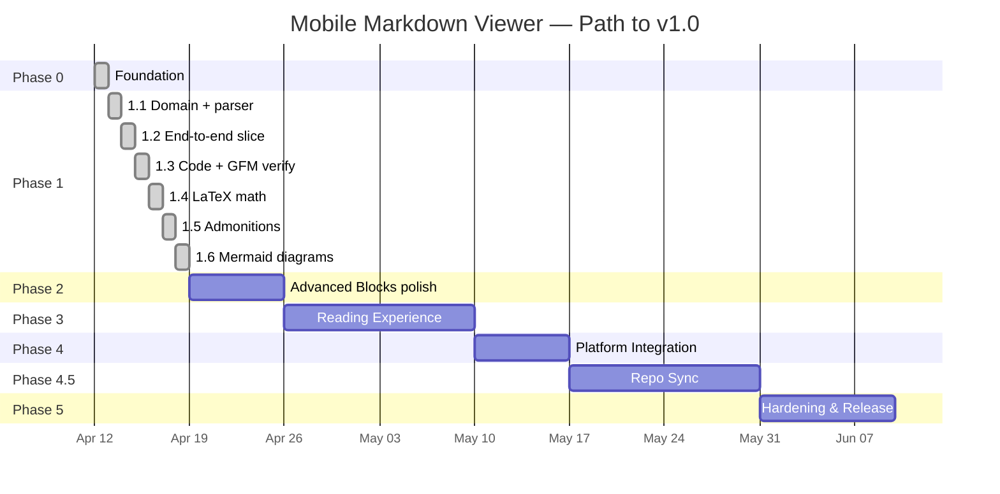

# Roadmap

Phased delivery plan from foundation to v1.0 release. Phase durations
are estimates; gates are firm.

## Timeline Overview

## Phase 0 — Foundation

**Status**: ✅ Completed 2026-04-12

**Goal**: Empty-but-valid Flutter project wired to all tooling.

- [x] Initialize Flutter project on Flutter 3.41+ (Dart 3.11 bundled)
- [x] Configure `analysis_options.yaml` per coding standards
- [x] Add full dependency stack to `pubspec.yaml` (Riverpod, go_router,
      drift, freezed, dio, markdown, mermaid WebView, math, etc.)
- [x] Set up i18n infrastructure with English and Turkish defaults
      (`lib/l10n/`, `l10n.yaml`, `context.l10n` extension)
- [x] Set up CI pipeline (lint, analyze, test, coverage, Android + iOS
      debug builds) — `.github/workflows/ci.yml`
- [x] Configure pre-commit hooks (`tool/git-hooks/pre-commit` +
      `tool/install-hooks.sh`) — format, analyze, ARB key parity
- [x] Create skeleton feature folders (`lib/features/library/`)
- [x] Wire Material 3 theme with light / dark + dynamic color
      (`lib/app/theme.dart`)
- [x] First screen: empty `LibraryScreen` routed via go_router, fully
      localized
- [x] Smoke widget test (`test/widget_test.dart`)
- [ ] Establish golden test baseline _(deferred to early Phase 1)_

**Exit criteria**: CI green on an empty app that renders correctly in
both themes. ✅ `flutter analyze` clean, smoke test passing.

## Phase 1 — MVP Rendering

**Status**: ✅ Completed 2026-04-13 — all six slices shipped. Manual
on-device validation pass is the gate to declaring Phase 2 ready.

**Goal**: Open a file and render every block type we promise, correctly
and legibly, on both themes. Phase 1 is split into six thin slices so
each can ship, be reviewed, and stay under a tight commit size.

### Phase 1.1 — Domain + parser

**Status**: ✅ Completed 2026-04-12

- [x] Sealed `Failure` hierarchy in `lib/core/errors/failure.dart`
- [x] `Document`, `HeadingRef` (freezed) + `DocumentId` extension type
- [x] `DocumentRepository` domain port
- [x] `MarkdownParser` (CommonMark + GFM, recursive heading walk,
      stable slug anchors, BOM-safe UTF-8 decode)
- [x] `DocumentRepositoryImpl` with typed failure mapping +
      `Isolate.run` offload for documents ≥ 200 KiB
- [x] Unit tests: parser (nested headings, BOM, invalid UTF-8,
      line counting), repo (happy / missing / permission / parse /
      isolate-branch), failure (cause-leak regression)

### Phase 1.2 — End-to-end thin slice

**Status**: ✅ Completed 2026-04-13

- [x] Shared `ErrorView` + `LoadingView` in `lib/core/widgets/`
- [x] `viewerDocumentProvider` (`@riverpod` family) application provider
- [x] Domain-inverted `documentRepositoryProvider` wired at the
      composition root via `ProviderScope.overrides` in `lib/main.dart`
- [x] `mapFailureToViewerMessage` — exhaustive sealed switch
- [x] `ViewerScreen` reading the provider and dispatching on
      `AsyncValue.when` (loading / error with retry / data)
- [x] `MarkdownView` with default `markdown_widget` config
- [x] `/viewer?path=…` route + `ViewerRoute` helpers in `go_router`
- [x] Library screen "Open file" button wired to `file_picker` →
      `context.go`
- [x] Unit + widget tests: notifier state transitions, mapper
      exhaustive TR/EN check, viewer screen three states

### Phase 1.3 — Themed code blocks + GFM verification

**Status**: ✅ Completed 2026-04-13

- [x] Theme-aware `PreConfig` using Material 3 `surfaceContainer*`
      colours + `outlineVariant` border
- [x] `atomOneLight` / `atomOneDark` syntax themes from
      `flutter_highlight` (added as direct dep)
- [x] Fixtures: `code_blocks.md` (dart, bash, json, unknown, no-lang)
      and `gfm_features.md` (table, task list, footnote, strikethrough)
- [x] Widget tests locking in highlighting, table rendering, task-list
      checkbox icons, footnotes, strikethrough on both themes
- [x] `appLoggerProvider` Riverpod binding (replacing the rejected
      top-level `appLogger` singleton)

### Phase 1.4 — LaTeX math

**Status**: ✅ Completed 2026-04-13

**Goal**: Render inline `$…$` and block `$$…$$` math using
`flutter_math_fork`, plugged into `markdown_widget` via custom inline
and block builders.

- [x] Custom `InlineSyntax` / `BlockSyntax` recognising `$…$` and
      `$$…$$` (with `(?!\d)` currency lookahead and a block-level
      `$$ … $$` syntax that refuses to match mid-paragraph)
- [x] `flutter_math_fork` widget wrappers in the presentation layer
      (inline wraps into a `WidgetSpan`, block wraps with horizontal
      scroll for long equations)
- [x] Extended `MarkdownView` config with the custom builders
- [x] Fixture `math.md` with inline expressions, display equations,
      a matrix, and a broken expression that must fall back to a
      styled placeholder
- [x] Widget tests: inline math round-trip, block math centred,
      malformed math surfaces an error placeholder
- [x] Parser-level unit tests for the custom syntax (currency
      collision, escaped dollar, multi-line opener/closer)

### Phase 1.5 — Admonitions

**Status**: ✅ Completed 2026-04-13

**Goal**: Recognise GitHub-style `> [!NOTE|TIP|IMPORTANT|WARNING|CAUTION]`
blockquote alerts and render themed containers.

- [x] Wired `package:markdown`'s built-in `AlertBlockSyntax` for
      parsing (no custom syntax needed once GitHub aligned on
      blockquote alerts instead of the old `!!!` fence)
- [x] `AdmonitionView` widget keyed off Material 3 container roles
      (primary/tertiary/secondary/error) per kind, with kind-specific
      icon + localized title
- [x] `MarkdownView` config extension via `AdmonitionSpanNode`
- [x] Class-guarded title-paragraph drop so a future
      `AlertBlockSyntax` change cannot silently eat user content
- [x] Fixture + widget tests for each admonition kind, including the
      "unknown kind falls through to a normal blockquote" path

### Phase 1.6 — Mermaid diagrams

**Status**: ✅ Completed 2026-04-13

**Goal**: Render mermaid fenced code blocks as inline SVGs through a
sandboxed, pre-warmed `InAppWebView`. This is the heaviest slice in
Phase 1 and may span multiple commits.

- [x] Bundle `mermaid.min.js` as a project asset (fetched by
      `tool/fetch_mermaid.sh` with pinned version + SHA-256, not
      committed to git — CI runs the script before tests/builds)
- [x] `MermaidRenderer` service with an async render queue and LRU
      `sha256(source) → svg` cache (in-memory, bounded), plus
      in-flight collapse for concurrent identical requests
- [x] Pre-warmed `HeadlessInAppWebView` created at app start,
      sandboxed per
      [security-standards.md](standards/security-standards.md)
      (`blockNetworkLoads`, no file access, CSP meta tag, single
      `mermaidResult` JS bridge handler)
- [x] `MermaidBlock` widget hooked into `MarkdownView`'s
      `PreConfig.wrapper` that detects `language == 'mermaid'` and
      renders the returned SVG via `flutter_svg`
- [x] Error UI for failed mermaid parses (inline warning placeholder
      that reuses the existing admonition warning palette, never
      crashes the document)
- [x] Fixtures: flowchart, sequence diagram, class diagram, state
      diagram, ER diagram, gantt, a broken mermaid source
- [x] Widget + unit tests including the broken-source case
- [x] Real-WebView integration test
      (`integration_test/mermaid_render_test.dart`) drives the
      production `HeadlessMermaidJsChannel` end-to-end: bundled
      asset load, real flowchart → SVG round-trip, broken source →
      typed failure with recovery, cache hit on repeat render, every
      diagram type from the fixture rendering successfully
- [x] Performance measurement against the < 800 ms typical budget —
      the integration test asserts `prewarm + first render < 800 ms`
      and prints the actual cold-path duration so future regressions
      have a data point

**Exit criteria**: Every mermaid diagram type from
[features.md](features.md) renders on both themes; the renderer
survives an instant theme flip; malformed diagrams never crash the
viewer.

**Phase 1 exit criteria**: A typical README (`test/fixtures/markdown/
typical.md` + a math-heavy doc + a mermaid-heavy doc) renders
pixel-correct vs GitHub's renderer with matching semantics;
domain + application + data coverage ≥ 80 %.

## Phase 2 — Advanced Blocks Polish

**Goal**: Harden and measure what Phase 1.4-1.6 shipped. This phase
is mostly benchmarking, caching, and regression coverage — not new
surface area.

- [ ] Performance benchmarks vs budgets in
      `integration_test/benchmark/` (decode, parse, render, mermaid,
      code highlight, math)
- [ ] Mermaid SVG cache hit-rate instrumentation
- [ ] Math layout jitter check (no reflow on scroll)
- [ ] Golden test baseline for every block type

**Exit criteria**: 10 sample mermaid diagrams, a math-heavy
document, and a 10k-line typical README all render within the
budgets in [rendering-pipeline.md](rendering-pipeline.md) on the
reference devices in [platform-support.md](platform-support.md).

## Phase 3 — Reading Experience

**Goal**: Polish the reading UX.

- Table of contents drawer
- In-document search with match highlighting
- Font size and family settings
- Reading width preference
- Share-intent import handling
- Recent files (drift)
- Favorites

**Exit criteria**: A 10-minute reading session on a real document feels
comfortable on phone and tablet.

## Phase 4 — Platform Integration

- Register as default `.md` handler on Android
- iOS Files app integration
- Share-to-PDF export
- App icons, splash screens, store assets
- Accessibility audit pass

## Phase 4.5 — Repo Sync

**Goal**: Pull markdown documentation from a public git repository URL
into the local library, preserving the directory structure.

- URL parser for GitHub `tree` and `blob` URLs (and bare repo URLs)
- GitHub provider via REST API + `raw.githubusercontent.com`
- Recursive `.md` discovery filtered to a sub-path
- Local mirroring under app documents directory
- `synced_repos` table in drift with refresh and conflict policy
- Optional Personal Access Token storage in platform secure storage
- Sync progress UI with cancel and partial-failure handling
- Background isolate for the sync work
- See [ADR-0011](decisions/0011-network-access-policy.md) and
  [ADR-0012](decisions/0012-document-sync-architecture.md)

**Exit criteria**: A 50-file documentation directory from a public GitHub
repo syncs in < 30s on Wi-Fi, with progress shown and resumable on failure.

## Phase 5 — Hardening & Release

- Full a11y audit (TalkBack, VoiceOver)
- Performance regression suite enforcement
- Memory leak profiling
- Localization pass (en + tr)
- Beta release to TestFlight + Google Play internal track
- Bug fixes
- Public v1.0 release

## Post-v1 Candidates

- HarmonyOS support via OpenHarmony Flutter engine
- Additional sync providers: GitLab, Bitbucket, Gitea
- Folder browsing
- Cloud provider integration (Google Drive, iCloud)
- Presentation mode
- Reading progress sync
- Plugin system for custom block renderers
