# Roadmap

Phased delivery plan from foundation to v1.0 and beyond.

```mermaid
graph LR
    P0[Phase 0<br/>Foundation] --> P1[Phase 1<br/>MVP Rendering]
    P1 --> P2[Phase 2<br/>Block Polish]
    P2 --> P3[Phase 3<br/>Reading UX]
    P3 --> P4[Phase 4<br/>Platform Integration]
    P4 --> P45[Phase 4.5<br/>Repo Sync]
    P45 --> P5[Phase 5<br/>Hardening & Release]
    P5 --> V1[v1.0]
    V1 --> P6[Phase 6<br/>Library depth & diagrams]
    P6 --> V11[v1.1]
    V11 --> P7[Phase 7<br/>Hardening closeout]
    P7 --> V12[v1.2]
    V12 --> V121[v1.2.1]
    V121 --> V13[v1.3]

    style P0 fill:#2e7d32,color:#fff
    style P1 fill:#2e7d32,color:#fff
    style P2 fill:#2e7d32,color:#fff
    style P3 fill:#2e7d32,color:#fff
    style P4 fill:#2e7d32,color:#fff
    style P45 fill:#2e7d32,color:#fff
    style P5 fill:#2e7d32,color:#fff
    style V1 fill:#2e7d32,color:#fff
    style P6 fill:#2e7d32,color:#fff
    style V11 fill:#2e7d32,color:#fff
    style P7 fill:#2e7d32,color:#fff
    style V12 fill:#2e7d32,color:#fff
    style V121 fill:#2e7d32,color:#fff
    style V13 fill:#2e7d32,color:#fff
```

## Phase 0 — Foundation ✅

Empty-but-valid Flutter project wired to all tooling.

- [x] Flutter 3.41+ project with full dependency stack
- [x] `analysis_options.yaml`, pre-commit hooks, CI pipeline
- [x] i18n infrastructure (English + Turkish)
- [x] Material 3 theme (light / dark + dynamic color)
- [x] Skeleton feature folders + `LibraryScreen` via go_router
- [x] Smoke widget test

## Phase 1 — MVP Rendering ✅

Open a file and render every block type correctly on both themes.

| Slice | Scope |
|-------|-------|
| 1.1 | Domain model, parser (CommonMark + GFM, heading walk, BOM-safe UTF-8) |
| 1.2 | End-to-end thin slice (viewer screen, file picker, error/loading states) |
| 1.3 | Themed code blocks + GFM verification (tables, task lists, footnotes) |
| 1.4 | LaTeX math (inline + block via `flutter_math_fork`, custom syntax) |
| 1.5 | Admonitions (GitHub-style `> [!NOTE]` alerts) |
| 1.6 | Mermaid diagrams (sandboxed WebView, LRU cache, error recovery) |
| 1.7 | UX polish: mermaid theming, pan/zoom, recent documents, library redesign, reading-position bookmark, back-to-top FAB |
| 1.8 | Folder explorer + multi-source library drawer |
| 1.9 | Source picker model (Recents / Folder sources, folder search) |
| 1.10 | Native folder bridge (iOS security-scoped bookmarks + Android SAF) |
| 1.11 | Bookmark tap/long-press semantics refinement |

## Phase 2 — Advanced Blocks Polish ✅

Harden and measure Phase 1 rendering.

- [x] Performance benchmarks (parse < 200 ms, build < 150 ms, mermaid < 800 ms)
- [x] Mermaid SVG cache hit-rate instrumentation
- [x] Math layout jitter regression test
- [x] Golden test baseline for every block type (light + dark)

## Phase 3 — Reading Experience ✅

Polish the reading UX for comfortable long-form reading.

- [x] Table of contents drawer with tap-to-navigate
- [x] In-document search with inline highlighting (browser find-in-page style)
- [x] Reading comfort settings (font scale, reading width, line height)
- [x] Immersive scroll (auto-hide AppBar + FAB)
- [x] Sepia reading theme
- [x] Keep-screen-on toggle
- [x] Text selection + copy + share
- [x] In-doc anchor links
- [x] Footnote popup sheets
- [x] Reading time estimate
- [x] Haptic feedback on navigation actions
- [ ] Swipe between adjacent files
- [ ] Share-intent import handling

## Phase 4 — Platform Integration ✅

Native platform features and distribution readiness.

- [x] Default `.md` handler (Android intents + iOS `CFBundleDocumentTypes`)
- [x] Splash screens (light/dark, Material You on Android 12+)
- [x] PDF export with mermaid + math rendering preserved
- [x] App icons (adaptive Android + flat iOS)
- [x] Accessibility audit (semantic annotations, 44 dp touch targets, a11y tests)

## Phase 4.5 — Repo Sync ✅

Pull markdown from GitHub repositories into the local library.
See [ADR-0011](decisions/0011-network-access-policy.md) and
[ADR-0012](decisions/0012-document-sync-architecture.md).

- [x] GitHub URL parser (tree, blob, bare repo shapes)
- [x] Trees API discovery + raw download (SHA-based incremental re-sync)
- [x] Drift-backed persistence (`synced_repos` + `synced_files`)
- [x] Local mirror preserving remote directory structure
- [x] Optional PAT in platform Keychain / Keystore (encrypted at rest)
- [x] Progress UI with cancel, partial-failure tolerance
- [x] Re-sync + remove from drawer, relative time display
- [x] Background isolate for large-repo JSON decoding

## Phase 5 — Hardening & Release ✅

Stabilize, harden, and ship v1.0 — tag `v1.0.0` pushed 2026-04-17,
TestFlight + Play Console internal-track upload triggered by the
release pipeline. Production-track rollout is a manual action in
the Play Console UI once the internal build is verified, per
[docs/release-process.md](release-process.md).

### Completed

- [x] Mermaid in PDF export (pre-render pipeline + fallback placeholder)
- [x] PDF text quality (Latin Extended-A transliteration, emoji labels)
- [x] Mermaid DOM cleanup, `look: classic`, `antiscript` security
- [x] Code-review hardening (FNV-1a hash, host-validated PAT, cache fix)
- [x] First-run onboarding (4-page animated flow, version-gated re-show)
- [x] System-locale resolution hardening (explicit `tr`/`en` callback)
- [x] Release pipeline (tag-triggered CI/CD → TestFlight + Play Console)
- [x] iOS/Android signing infrastructure
- [x] App Store compliance (ITMS-90683, ITMS-90725, encryption declaration)
- [x] Release runbook (`docs/release-process.md`)
- [x] Beta release to TestFlight + Play Console (v0.2.1, v0.2.2)
- [x] Logging & observability Phase 1 (error hooks + structured logging) — see [ADR-0014](decisions/0014-logging-and-observability.md)
- [x] Sentry crash reporting Phase 2 (consent-gated, full stack)
- [x] GitHub Pages site (landing page, privacy policy, terms, contact)
- [x] GitHub Discussions setup
- [x] Full-application code review (128 findings across 8 streams; all P0/P1 closed, 32/40 P2 closed) — see [docs/analysis/codereviews/codereview-report-20260416.md](analysis/codereviews/codereview-report-20260416.md)
- [x] Architecture layer refactor (P2-1..5): PDF exporter to application, SettingsStore / ConsentStore ports in domain, materializer provider in application, native channel DI
- [x] TOC navigation hardening (heading match by `(level, text)` instead of positional zip; resolves misalignment when parser and `markdown_widget` produce different list counts)
- [x] iOS container UUID resilience (`SandboxPath` translates absolute ↔ `sandbox:<kind>:<relative>` at the persistence boundary so dev reinstalls / restore-from-backup do not strand recents or synced repos)
- [x] SQLite variable-limit hardening (orphan delete batched in chunks of 500 to stay under `SQLITE_LIMIT_VARIABLE_NUMBER`)
- [x] Reduce-motion polish (onboarding animations + viewer `AnimatedSize` gate on `MediaQuery.disableAnimations`)
- [x] UI copy shortening (language label, reading-width label) + destructive haptics on clear-all
- [x] `sentry_flutter` bumped to `^9.0.0` for Kotlin 2.2.20 compatibility
- [x] Self-clean stale recents (recents entries whose backing file no longer exists are purged on library load)
- [x] `leak_tracker` integration — globally enabled in test harness, caught and fixed `routerProvider` GoRouter lifecycle leak; per-file opt-outs documented for upstream `markdown_widget` (`TapGestureRecognizer`) and Flutter image-cache (`ImageStreamCompleterHandle`, `_LiveImage`) leaks
- [x] Dedicated security review (1 High + 8 Medium + 8 Low findings) — High (URL scheme allow-list) and four Medium (host allow-list, response size caps, iOS / Android `readFileBytes` caps, share-intent copy caps) closed before tag. See [docs/analysis/securityreports/20260417T091912-security-review.md](analysis/securityreports/20260417T091912-security-review.md)
- [x] Tag `v1.0.0` published; GitHub Actions release pipeline uploaded the signed IPA to TestFlight and signed AAB to Play Console's internal track (2026-04-17)

### Remaining (post-v1 polish, not release-blocking)

- [ ] Tests for `repo_sync`, `onboarding`, `observability` (P2-6..8)
- [ ] CI coverage floor enforcement (P2-9)
- [ ] Performance regression suite enforcement
- [ ] Memory leak profiling
- [ ] Sentry performance tracing for key operations
- [ ] Drift schema migration strategy (P2-12)
- [ ] Remaining P2 / P3 nits — see code-review report
- [ ] Remaining security-review findings (M-3 redirect token [covered by M-1 interceptor], M-4 5xx retry/backoff, M-6 iOS symlink resolution, L-1..L-8)

## Phase 6 — Library depth & diagram ergonomics (v1.1) ✅

First minor release after v1.0. Theme: turn the library itself into
the reference surface and make dense diagrams actually readable on a
phone.

- [x] **Library-wide full-text content search** — debounced, isolate-
  backed scan over every recent document, folder source and synced
  repository body. Matches render below the name-filter list under a
  dedicated header with highlighted snippet, source-label badge and
  multi-match counter. Per-file size cap (10 MB) and per-query file
  cap (2000) keep a large monorepo from stalling the UI.
- [x] **Pull-to-refresh across every library surface** — Recents
  re-reads the persisted snapshot; folder sources re-enumerate the
  directory; synced-repo sources run a full `RepoSyncNotifier.startSync`
  against the stored GitHub URL, with the indicator visible for the
  full round-trip.
- [x] **Mermaid fullscreen viewer** — expand-icon affordance on every
  rendered diagram opens a dedicated route with pinch-zoom up to 10×,
  free pan, reset-to-identity control and tap-to-toggle translucent
  chrome. Popping back restores the host document's exact scroll
  offset.
- [x] Tag `v1.1.0` published; release pipeline uploaded the signed IPA
  to TestFlight and the signed AAB to the Play Console production
  track (2026-04-19)

## Phase 7 — Hardening closeout (v1.2) ✅

Third minor release, planned as the final active development
iteration for the app. Three parallel 2026-04-19 reviews (code /
security / performance — 134 findings total) landed every P1 / High
and the majority of P2 / Medium items into a single hardening
batch, plus the mermaid dark-mode rendering fixes surfaced during
on-device verification.

### Completed

- [x] **Security hardening** — Android `allowBackup=false` +
  data-extraction rules; Android network-security-config
  (cleartext denied, domain allow-list pinned); iOS Keychain
  scoped to `first_unlock_this_device`; iOS entitlements file
  pinned to `$(CFBundleIdentifier)`; GitHub-sync redirects no
  longer carry the `Authorization` header off the host allow-
  list; Sentry payload PII redaction
  (`beforeBreadcrumb` / `beforeSend`); Sentry DSN host validated
  against the ingest host allow-list; mermaid sandbox CSP
  tightened; `receive_sharing_intent` dependency removed (zero
  call sites, native attack surface).
- [x] **Screen-capture guard on the GitHub PAT entry**
  (Android `FLAG_SECURE`, iOS `UIScreen.isCaptured`).
- [x] **Drift schema v2 migration** — `synced_repos.etag` column,
  three secondary indices (natural-key UNIQUE, `last_synced_at`,
  `synced_files.repo_id`); pre-create-index deduplication so
  any v1 duplicate rows do not fail the ALTER mid-flight.
- [x] **Database moved to `ApplicationSupport/`** on both
  platforms with a one-time migration from the legacy
  `Documents/` location (SR-012).
- [x] **GitHub-sync 5xx retry with exponential backoff**
  (M-4 closed).
- [x] **Mermaid diagrams track Material 3 in dark mode** — ER
  attribute rows + entity titles, gitgraph commit dots / arrows
  / branch labels all render against the active surface tones
  instead of defaulting to hardcoded white / lightgrey. Theme
  overlay scoped narrowly to ER + gitgraph so user-authored
  `classDef` blocks in flowcharts / class / state diagrams are
  preserved.
- [x] **Pull-to-refresh works from every library-body state**
  (loading / empty / error / populated).
- [x] **Onboarding Reduce-Motion coverage extended** to the
  Next-button advance and the per-page entrance tween.
- [x] **Content-search races eliminated** (dispatch-sequence
  token; Turkish case-folded offset bug fixed; walker honours
  file-count cap mid-walk).
- [x] **Math body DoS guard** — 8 000 code-unit hard cap on
  inline + display math bodies; oversized input surfaces as
  literal text. Inline fallback emits an `md.Text` node so the
  document tree stays structurally valid.
- [x] **Folder cache-prune respects the newly-materialised
  file** and guards each `entity.stat()` with its own try/
  catch so a single flaky stat does not abort the sweep.
- [x] **Sentry init failures no longer propagate** into
  `PlatformDispatcher.onError` during cold start — the
  `unawaited` init now swallows `SentryFlutter.init` exceptions.
- [x] **Diagram fullscreen no longer permanently flips the app
  into `edgeToEdge`** (CR-004 closed).
- [x] **ARB metadata parity between `app_en` and `app_tr`** —
  every `@key` block mirrored so `locale_completeness_test`
  enforces metadata presence, not just key presence.
- [x] Tag `v1.2.0` published; release pipeline uploaded the signed
  IPA to TestFlight and the signed AAB to the Play Console
  production track (2026-04-20).

### v1.2.1 patch (2026-04-21)

- [x] **Large-repo sync surfaces a helpful error.** Syncing a repo
  whose Git tree exceeds GitHub's 100 000-entry limit (e.g.
  `torvalds/linux`) now maps the truncated-tree + oversized-body
  paths to `RepoTooLargeFailure` with a message guiding the user
  to paste a subdirectory URL instead.
- [x] **Document sharing exports a named `.md` file.** The share
  sheet now attaches a temporary `.md` file named after the
  document title (unsafe chars sanitised, truncated to 64
  codepoints) with the correct MIME type. Share failures surface
  a localised snackbar instead of being silently dropped.
- [x] **Deeply nested folder trees display correctly.** Fixed a
  cumulative-indent bug that pushed filenames off-screen at depth
  5+. Each level now adds a fixed delta offset and vertical tree
  guide lines aid orientation (RTL-safe).
- [x] **iOS entitlements build warning eliminated.** Removed the
  `keychain-access-groups` entry; the implicit per-app default
  provides identical isolation without triggering a variable-
  expansion rewrite at sign time.
- [x] Tag `v1.2.1` published; app live on the **App Store**
  (https://apps.apple.com/us/app/markdown-viewer-mobile/id6762259375)
  and **Google Play** (2026-04-21).

### v1.3.0 release (2026-04-21)

Small library-ergonomics release driven by post-launch user
feedback.

- [x] **Collapse-all button next to the library search bar.**
  Closes every expanded folder in the visible tree at once.
  Disabled while a search query is active. Each tile owns its
  own `ExpansibleController` and listens to a shared
  `ValueNotifier<int>` "collapse trigger" hoisted to the body
  state.
- [x] **Rename action on folder and synced-repo sources.**
  Long-press surface gains a "Rename" entry that opens a shared
  `showSourceRenameDialog` (StatefulWidget owning its
  `TextEditingController`). The current label is pre-selected
  so the first keystroke replaces it; an empty / whitespace
  confirm clears the override and falls back to the default
  label. Drift schema bumped to v3 with a new
  `synced_repos.custom_name` column; `LibraryFolder` gained a
  `customName` field with sentinel-driven `copyWith`.
- [x] **Active-source notifier tracks rename changes.** The
  AppBar title, drawer, content-search labels, and Recents
  source list rebuild instantly against the new label without
  waiting on the next navigation.
- [x] **Re-sync preserves user-supplied names.** The drift
  store's upsert path re-reads the canonical row after writing
  so the returned entity carries the persisted `customName`
  and `etag`. Previously a re-sync from a fresh URL parse
  silently dropped the rename.

### Explicitly out of scope (tracked as post-v1 items)

- [ ] `Authorization: Bearer` vs `token` migration (L-4, low-risk,
  waits on upstream GitHub deprecation).
- [ ] Numeric performance pass on real devices (Phase 0 budgets
  confirmed by static review; field measurement is a separate
  operational exercise).
- [ ] Macro dirty golden (`test/golden/features/viewer/presentation/goldens/macos/code_blocks.png`)
  — diff is theme-neutral and flagged as a stale baseline rather
  than a regression.

## Post-v1 Candidates

- Full a11y audit (TalkBack + VoiceOver end-to-end) — carried forward
- HarmonyOS support via OpenHarmony Flutter engine
- Additional sync providers (GitLab, Bitbucket, Gitea)
- Cloud provider integration (Google Drive, iCloud)
- Presentation mode
- Reading progress sync across devices
- Plugin system for custom block renderers
- Swipe between adjacent files
- Share-intent import handling
- AMOLED true-black dark variant
- Tablet two-pane layout
