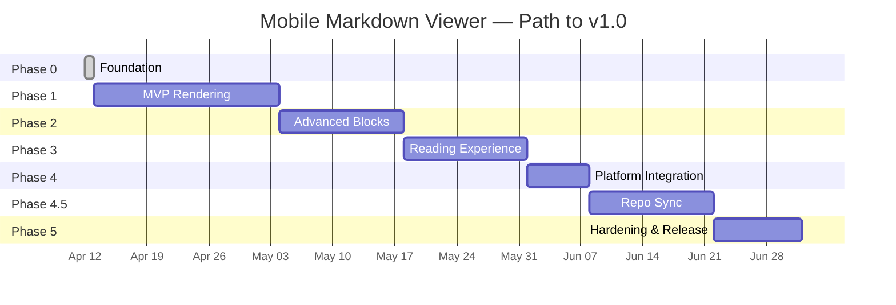

# Roadmap

Phased delivery plan from foundation to v1.0 release. Phase durations
are estimates; gates are firm.

## Timeline Overview

## Phase 0 — Foundation

**Status**: ✅ Completed 2026-04-12

**Goal**: Empty-but-valid Flutter project wired to all tooling.

- [x] Initialize Flutter project on Flutter 3.41+ (Dart 3.11 bundled)
- [x] Configure `analysis_options.yaml` per coding standards
- [x] Add full dependency stack to `pubspec.yaml` (Riverpod, go_router,
      drift, freezed, dio, markdown, mermaid WebView, math, etc.)
- [x] Set up i18n infrastructure with English and Turkish defaults
      (`lib/l10n/`, `l10n.yaml`, `context.l10n` extension)
- [x] Set up CI pipeline (lint, analyze, test, coverage, Android + iOS
      debug builds) — `.github/workflows/ci.yml`
- [x] Configure pre-commit hooks (`tool/git-hooks/pre-commit` +
      `tool/install-hooks.sh`) — format, analyze, ARB key parity
- [x] Create skeleton feature folders (`lib/features/library/`)
- [x] Wire Material 3 theme with light / dark + dynamic color
      (`lib/app/theme.dart`)
- [x] First screen: empty `LibraryScreen` routed via go_router, fully
      localized
- [x] Smoke widget test (`test/widget_test.dart`)
- [ ] Establish golden test baseline _(deferred to early Phase 1)_

**Exit criteria**: CI green on an empty app that renders correctly in
both themes. ✅ `flutter analyze` clean, smoke test passing.

## Phase 1 — MVP Rendering

**Goal**: Open a file and render core markdown correctly.

- Domain models: `Document`, `Heading`, `Block`, `Failure`
- `markdown` package integration with GFM enabled
- Custom block syntax stubs (mermaid, math, admonitions)
- `markdown_widget` integration with theming
- Syntax-highlighted code blocks
- Tables, task lists, footnotes
- File picker integration
- Failure mapping and error UI

**Exit criteria**: A typical README renders pixel-correct vs GitHub's
renderer; coverage ≥ 80%.

## Phase 2 — Advanced Blocks

**Goal**: Mermaid and math working end-to-end within performance budgets.

- Bundled `mermaid.min.js` asset
- Pre-warmed `InAppWebView` for mermaid rendering
- `flutter_math_fork` integration for inline and block math
- SVG caching layer
- Performance benchmarks vs budgets in `integration_test/benchmark/`

**Exit criteria**: 10 sample mermaid diagrams and a math-heavy document
render within performance budgets on reference devices.

## Phase 3 — Reading Experience

**Goal**: Polish the reading UX.

- Table of contents drawer
- In-document search with match highlighting
- Font size and family settings
- Reading width preference
- Share-intent import handling
- Recent files (drift)
- Favorites

**Exit criteria**: A 10-minute reading session on a real document feels
comfortable on phone and tablet.

## Phase 4 — Platform Integration

- Register as default `.md` handler on Android
- iOS Files app integration
- Share-to-PDF export
- App icons, splash screens, store assets
- Accessibility audit pass

## Phase 4.5 — Repo Sync

**Goal**: Pull markdown documentation from a public git repository URL
into the local library, preserving the directory structure.

- URL parser for GitHub `tree` and `blob` URLs (and bare repo URLs)
- GitHub provider via REST API + `raw.githubusercontent.com`
- Recursive `.md` discovery filtered to a sub-path
- Local mirroring under app documents directory
- `synced_repos` table in drift with refresh and conflict policy
- Optional Personal Access Token storage in platform secure storage
- Sync progress UI with cancel and partial-failure handling
- Background isolate for the sync work
- See [ADR-0011](decisions/0011-network-access-policy.md) and
  [ADR-0012](decisions/0012-document-sync-architecture.md)

**Exit criteria**: A 50-file documentation directory from a public GitHub
repo syncs in < 30s on Wi-Fi, with progress shown and resumable on failure.

## Phase 5 — Hardening & Release

- Full a11y audit (TalkBack, VoiceOver)
- Performance regression suite enforcement
- Memory leak profiling
- Localization pass (en + tr)
- Beta release to TestFlight + Google Play internal track
- Bug fixes
- Public v1.0 release

## Post-v1 Candidates

- HarmonyOS support via OpenHarmony Flutter engine
- Additional sync providers: GitLab, Bitbucket, Gitea
- Folder browsing
- Cloud provider integration (Google Drive, iCloud)
- Presentation mode
- Reading progress sync
- Plugin system for custom block renderers
