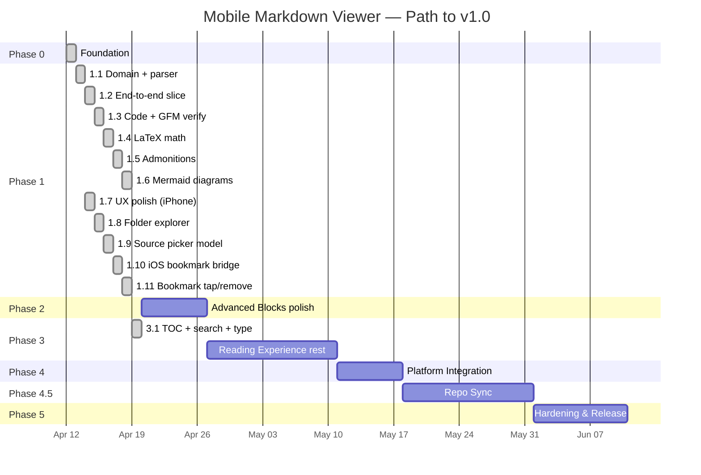

# Roadmap

Phased delivery plan from foundation to v1.0 release. Phase durations
are estimates; gates are firm.

## Timeline Overview

## Phase 0 — Foundation

**Status**: ✅ Completed 2026-04-12

**Goal**: Empty-but-valid Flutter project wired to all tooling.

- [x] Initialize Flutter project on Flutter 3.41+ (Dart 3.11 bundled)
- [x] Configure `analysis_options.yaml` per coding standards
- [x] Add full dependency stack to `pubspec.yaml` (Riverpod, go_router,
      drift, freezed, dio, markdown, mermaid WebView, math, etc.)
- [x] Set up i18n infrastructure with English and Turkish defaults
      (`lib/l10n/`, `l10n.yaml`, `context.l10n` extension)
- [x] Set up CI pipeline (lint, analyze, test, coverage, Android + iOS
      debug builds) — `.github/workflows/ci.yml`
- [x] Configure pre-commit hooks (`tool/git-hooks/pre-commit` +
      `tool/install-hooks.sh`) — format, analyze, ARB key parity
- [x] Create skeleton feature folders (`lib/features/library/`)
- [x] Wire Material 3 theme with light / dark + dynamic color
      (`lib/app/theme.dart`)
- [x] First screen: empty `LibraryScreen` routed via go_router, fully
      localized
- [x] Smoke widget test (`test/widget_test.dart`)
- [ ] Establish golden test baseline _(deferred to early Phase 1)_

**Exit criteria**: CI green on an empty app that renders correctly in
both themes. ✅ `flutter analyze` clean, smoke test passing.

## Phase 1 — MVP Rendering

**Status**: ✅ Completed 2026-04-14 — all eleven slices (1.1–1.11) shipped. Manual
on-device validation pass is the gate to declaring Phase 2 ready.

**Goal**: Open a file and render every block type we promise, correctly
and legibly, on both themes. Phase 1 is split into six thin slices so
each can ship, be reviewed, and stay under a tight commit size.

### Phase 1.1 — Domain + parser

**Status**: ✅ Completed 2026-04-12

- [x] Sealed `Failure` hierarchy in `lib/core/errors/failure.dart`
- [x] `Document`, `HeadingRef` (freezed) + `DocumentId` extension type
- [x] `DocumentRepository` domain port
- [x] `MarkdownParser` (CommonMark + GFM, recursive heading walk,
      stable slug anchors, BOM-safe UTF-8 decode)
- [x] `DocumentRepositoryImpl` with typed failure mapping +
      `Isolate.run` offload for documents ≥ 200 KiB
- [x] Unit tests: parser (nested headings, BOM, invalid UTF-8,
      line counting), repo (happy / missing / permission / parse /
      isolate-branch), failure (cause-leak regression)

### Phase 1.2 — End-to-end thin slice

**Status**: ✅ Completed 2026-04-13

- [x] Shared `ErrorView` + `LoadingView` in `lib/core/widgets/`
- [x] `viewerDocumentProvider` (`@riverpod` family) application provider
- [x] Domain-inverted `documentRepositoryProvider` wired at the
      composition root via `ProviderScope.overrides` in `lib/main.dart`
- [x] `mapFailureToViewerMessage` — exhaustive sealed switch
- [x] `ViewerScreen` reading the provider and dispatching on
      `AsyncValue.when` (loading / error with retry / data)
- [x] `MarkdownView` with default `markdown_widget` config
- [x] `/viewer?path=…` route + `ViewerRoute` helpers in `go_router`
- [x] Library screen "Open file" button wired to `file_picker` →
      `context.go`
- [x] Unit + widget tests: notifier state transitions, mapper
      exhaustive TR/EN check, viewer screen three states

### Phase 1.3 — Themed code blocks + GFM verification

**Status**: ✅ Completed 2026-04-13

- [x] Theme-aware `PreConfig` using Material 3 `surfaceContainer*`
      colours + `outlineVariant` border
- [x] `atomOneLight` / `atomOneDark` syntax themes from
      `flutter_highlight` (added as direct dep)
- [x] Fixtures: `code_blocks.md` (dart, bash, json, unknown, no-lang)
      and `gfm_features.md` (table, task list, footnote, strikethrough)
- [x] Widget tests locking in highlighting, table rendering, task-list
      checkbox icons, footnotes, strikethrough on both themes
- [x] `appLoggerProvider` Riverpod binding (replacing the rejected
      top-level `appLogger` singleton)

### Phase 1.4 — LaTeX math

**Status**: ✅ Completed 2026-04-13

**Goal**: Render inline `$…$` and block `$$…$$` math using
`flutter_math_fork`, plugged into `markdown_widget` via custom inline
and block builders.

- [x] Custom `InlineSyntax` / `BlockSyntax` recognising `$…$` and
      `$$…$$` (with `(?!\d)` currency lookahead and a block-level
      `$$ … $$` syntax that refuses to match mid-paragraph)
- [x] `flutter_math_fork` widget wrappers in the presentation layer
      (inline wraps into a `WidgetSpan`, block wraps with horizontal
      scroll for long equations)
- [x] Extended `MarkdownView` config with the custom builders
- [x] Fixture `math.md` with inline expressions, display equations,
      a matrix, and a broken expression that must fall back to a
      styled placeholder
- [x] Widget tests: inline math round-trip, block math centred,
      malformed math surfaces an error placeholder
- [x] Parser-level unit tests for the custom syntax (currency
      collision, escaped dollar, multi-line opener/closer)

### Phase 1.5 — Admonitions

**Status**: ✅ Completed 2026-04-13

**Goal**: Recognise GitHub-style `> [!NOTE|TIP|IMPORTANT|WARNING|CAUTION]`
blockquote alerts and render themed containers.

- [x] Wired `package:markdown`'s built-in `AlertBlockSyntax` for
      parsing (no custom syntax needed once GitHub aligned on
      blockquote alerts instead of the old `!!!` fence)
- [x] `AdmonitionView` widget keyed off Material 3 container roles
      (primary/tertiary/secondary/error) per kind, with kind-specific
      icon + localized title
- [x] `MarkdownView` config extension via `AdmonitionSpanNode`
- [x] Class-guarded title-paragraph drop so a future
      `AlertBlockSyntax` change cannot silently eat user content
- [x] Fixture + widget tests for each admonition kind, including the
      "unknown kind falls through to a normal blockquote" path

### Phase 1.6 — Mermaid diagrams

**Status**: ✅ Completed 2026-04-13

**Goal**: Render mermaid fenced code blocks as inline SVGs through a
sandboxed, pre-warmed `InAppWebView`. This is the heaviest slice in
Phase 1 and may span multiple commits.

- [x] Bundle `mermaid.min.js` as a project asset (fetched by
      `tool/fetch_mermaid.sh` with pinned version + SHA-256, not
      committed to git — CI runs the script before tests/builds)
- [x] `MermaidRenderer` service with an async render queue and LRU
      `sha256(source) → svg` cache (in-memory, bounded), plus
      in-flight collapse for concurrent identical requests
- [x] Pre-warmed `HeadlessInAppWebView` created at app start,
      sandboxed per
      [security-standards.md](standards/security-standards.md)
      (`blockNetworkLoads`, no file access, CSP meta tag, single
      `mermaidResult` JS bridge handler)
- [x] `MermaidBlock` widget hooked into `MarkdownView`'s
      `PreConfig.wrapper` that detects `language == 'mermaid'` and
      renders the returned SVG via `flutter_svg`
- [x] Error UI for failed mermaid parses (inline warning placeholder
      that reuses the existing admonition warning palette, never
      crashes the document)
- [x] Fixtures: flowchart, sequence diagram, class diagram, state
      diagram, ER diagram, gantt, a broken mermaid source
- [x] Widget + unit tests including the broken-source case
- [x] Real-WebView integration test
      (`integration_test/mermaid_render_test.dart`) drives the
      production `HeadlessMermaidJsChannel` end-to-end: bundled
      asset load, real flowchart → SVG round-trip, broken source →
      typed failure with recovery, cache hit on repeat render, every
      diagram type from the fixture rendering successfully
- [x] Performance measurement against the < 800 ms typical budget —
      the integration test asserts `prewarm + first render < 800 ms`
      and prints the actual cold-path duration so future regressions
      have a data point

**Exit criteria**: Every mermaid diagram type from
[features.md](features.md) renders on both themes; the renderer
survives an instant theme flip; malformed diagrams never crash the
viewer.

### Phase 1.7 — Post-MVP UX polish (iPhone feedback)

**Status**: ✅ Completed 2026-04-14

**Goal**: Address the rough edges surfaced by the first iPhone
test pass after declaring Phase 1 complete. Not an originally
planned slice — added because the device session produced a tight
list of high-impact follow-ups that were faster to ship as a
focused pass than to defer to Phase 3. Several items from Phase 3
were pulled forward as a side effect.

- [x] Mermaid diagram theming via `themeVariables` (`theme: "base"`
      pinned) wired to the active Material 3 `ColorScheme` so every
      diagram type — flowchart, sequence, class, state, gantt, ER —
      reads as if drawn by the app itself in light AND dark mode.
      User-authored `%%{init: …}%%` directives pass through
      untouched.
- [x] Mermaid SVG → native WKWebView snapshot pipeline
      (`controller.takeScreenshot`) replacing the SVG-string round
      trip after `flutter_svg` choked on real-world CSS-laden
      mermaid output. The renderer port now hands back PNG bytes +
      intrinsic dimensions; cache key is `sha256(initDirective +
      source)`.
- [x] Pan + pinch + reset affordance on every mermaid block via
      `InteractiveViewer` + a centre button that fades in once the
      transformation matrix leaves identity and animates back via
      `Matrix4Tween`.
- [x] Reading-position bookmark (`ReadingPositionStore` port +
      SharedPreferences impl keyed by sha256-hashed path) with an
      AppBar toggle and a first-frame post-frame restore that
      animates to the saved offset and shows a localized "Resumed
      from bookmark" snackbar.
- [x] Back-to-top FAB on `ViewerScreen`, fading in past 200 px of
      scroll, animating back to offset 0 over 450 ms.
- [x] `MarkdownView` switched from `MarkdownWidget` to
      `MarkdownGenerator.buildWidgets(...)` + a host the screen
      owns, so the viewer can hold the `ScrollController` the
      back-to-top FAB and bookmark restore both need. The host is
      `SingleChildScrollView` + `Column` (not `ListView.builder`)
      to keep `maxScrollExtent` stable — the lazy-layout builder
      produced visible thumb jitter on iPhone as new rows
      measured in.
- [x] Subtle theme-wide reading scrollbar
      (`ScrollbarThemeData`: 4 dp thumb, hidden by default,
      outline-tinted at 55% alpha) attached to the same controller
      so there is one source of truth.
- [x] Recent documents feature — full clean-architecture slice
      under `lib/features/library/`: `RecentDocument` value type
      with `isPinned` + `preview`, `RecentDocumentsStore` port,
      SharedPreferences-backed impl with backward-compatible JSON,
      `RecentDocumentsController` Notifier (touch / togglePin /
      remove / clear, LRU cap 20 on the unpinned tail, pinned
      entries exempt). The viewer's `ref.listen` records every
      successful load through one funnel so deep links + future
      folder explorer + cross-doc links all flow through the same
      mutator.
- [x] Library home screen redesign: greeting header (Good
      morning / afternoon / evening + recent count), live search
      filter (basename + parent folder + preview snippet),
      pinned section, time-grouped recents (Today / Yesterday /
      Earlier this week / Earlier), italic preview snippet line
      on each tile, long-press bottom sheet with Pin / Unpin and
      Remove from recents, no-results empty state.
- [x] Preview snippet extractor (`extractPreviewSnippet`): walks
      markdown source line by line, skips YAML frontmatter +
      fenced code + headings + blockquotes + list markers, strips
      inline markup, returns the first real prose paragraph
      capped at 140 chars. Fed by the viewer on every successful
      load so the home screen tile always carries the freshest
      hint.
- [x] L10n: 26 new keys across en + tr (mermaid reset, back-to-
      top tooltip, bookmark / resume snackbars, library greeting
      trio, search affordances, pinned section, time-group
      headers, pin / unpin actions, relative time plurals).

### Phase 1.8 — Folder explorer + multi-entry onboarding

**Status**: ✅ Completed 2026-04-14

**Goal**: Give the user a way to add arbitrary directories to
the library and browse their markdown files inline, plus a
unified "add documents" affordance on the populated home screen
that no longer privileges Open file over Open folder / Sync
repository. UX shape agreed with the user before coding: left
drawer (not bottom nav), multi-root, speed dial instead of the
extended FAB.

- [x] Domain: `LibraryFolder` value type, `LibraryFoldersStore`
      persistence port, `FolderEnumerator` service port with a
      sealed `FolderEntry` hierarchy (`FolderFileEntry` /
      `FolderSubdirEntry`) so the drawer's expansion tree has a
      narrow contract to render against.
- [x] Data: `LibraryFoldersStoreImpl` (SharedPreferences, JSON
      array keyed `library.folders`, corrupt-blob tolerant,
      malformed-entry skip); `FolderEnumeratorImpl` (dart:io,
      filters hidden dot-entries, sorts subdirs-first then
      case-insensitive alpha, case-insensitive `.md` /
      `.markdown` extension match). The enumerator is the only
      place inside the library feature that touches the
      filesystem.
- [x] Application: `LibraryFoldersController` Notifier with
      `add(path) → bool` (false on duplicate), `remove(path)`
      no-op on ghost paths, fire-and-forget persistence,
      newest-first canonical ordering.
- [x] UI: reusable `LibrarySpeedDial` widget — primary FAB
      toggles `+` ↔ `×`, three mini-FABs with label chips scale
      and fade in on a staggered delay, tap-outside barrier
      closes the dial. Used on the populated library state with
      entries for Open file, Open folder, and (disabled) Sync
      repository.
- [x] UI: `FolderExplorerDrawer` — Material 3 `Drawer` slid in
      from the left of `LibraryScreen`, renders one
      `ExpansionTile` per root, lazy loads children through
      `folderEnumeratorProvider` the first time a node is
      expanded, recurses one level per tap, shows inline
      localized hints for empty folders or enumeration failures,
      long-press-free remove button at the bottom of each root.
- [x] UI: library empty state upgraded from two buttons to
      three — Open file (filled), Open folder (tonal), Sync
      repository (disabled outlined).
- [x] UI: AppBar leading IconButton with a localized tooltip
      opens the drawer. Tapping a leaf markdown file inside the
      drawer closes the drawer and pushes `/viewer?path=…` so
      the existing recent-documents `ref.listen` funnel records
      the open without any extra wiring.
- [x] L10n: 17 new keys across en + tr (drawer title + empty
      state, add folder + picker failure / duplicate / cancel
      snackbars, inline empty-folder / enumeration-failed
      hints, long-press remove, speed dial entries + tooltips).
- [x] Tests (+18): store round-trip + malformed-entry skip,
      controller seed / add / dedupe / remove / ghost-no-op,
      folder enumerator against a real tmp directory (md+
      markdown detection, subdir ordering, dot-entry hiding,
      non-markdown skip, empty directory, missing directory,
      case-insensitive match), library widget empty-state
      three-button layout, drawer hamburger opens drawer,
      populated drawer renders one tile per persisted folder,
      speed dial expands on FAB tap.

**Known limitation (resolved in Phase 1.10)**: iOS
security-scoped bookmarks AND Android Storage Access Framework
content URIs were not wired in Phase 1.8, so a folder picked
via `file_picker.getDirectoryPath` would fail on the first
`Directory.list()` with "Permission denied" (iOS) or be
unreadable by `dart:io` entirely (Android, since SAF returns
`content://` URIs). Phase 1.10 ships native method-channel
bridges on both platforms that capture the persistent
permission grant at pick time and route every read back
through the channel.

### Phase 1.9 — Library source picker model

**Status**: ✅ Completed 2026-04-14

**Goal**: Rework the library screen around a single mental
model: the drawer is a **source picker**, the body is the
contents of whichever source is active. Phase 1.8 shipped the
drawer as an expandable-tree widget, which conflated "pick a
source" with "browse a folder" — tapping a folder in the
drawer only expanded its own row without changing the main
body, and the recents view was always the backdrop. The iPhone
test surfaced the dissonance. Phase 1.9 lands the redesign
agreed with the user (option C from the UX conversation) so
synced repositories will slot into the same drawer list in
Phase 4.5 without any redesign.

- [x] Domain: sealed `LibrarySource` hierarchy with
      `RecentsSource` and `FolderSource(LibraryFolder)`
      branches. Built-in sources + user-added folders all live
      in the same list — no special-casing.
- [x] Application: `ActiveLibrarySourceController` Notifier.
      In-memory state (not persisted), defaults to Recents on
      cold start, `selectRecents` / `selectFolder` mutators.
      Auto-falls back to Recents when the active folder is
      removed via a `ref.listen` on
      `libraryFoldersControllerProvider`, so the UI never
      renders against a dangling folder.
- [x] `FolderEnumerator.enumerateRecursive(path)` +
      `FolderEnumeratorImpl._walk` for the flat search view —
      walks the whole tree once, filters hidden dot-directories,
      sorts results case-insensitively. Cached inside the
      folder body for the lifetime of that folder source so
      subsequent keystrokes filter the cached list without
      re-walking.
- [x] `SourcePickerDrawer` replaces the old
      `FolderExplorerDrawer`. Flat list of sources: the
      built-in Recents tile pinned at the top, a "Sources"
      section header + one tile per user-added folder, and an
      "+ Add source" button at the bottom that opens the
      `AddSourceSheet` bottom sheet. Tapping a source sets the
      active source and closes the drawer. Long-pressing a
      folder tile offers "Remove folder" with a snackbar.
      Selected source is visually highlighted.
- [x] `AddSourceSheet` bottom sheet exposes "Add folder" (real)
      and "Sync repository" (disabled, wired for Phase 4.5).
      The sheet owns the folder-picker flow so neither the
      drawer nor the library screen has to duplicate it.
- [x] New `LibraryFolderBody` widget rendered when the active
      source is a folder:
      - **Browsing mode** (empty search): full-width lazy
        `ExpansionTile` tree rooted at the folder, recursive
        one level per expand. The cramped drawer tree is
        promoted to the main viewport where deep hierarchies
        are actually readable.
      - **Search mode** (non-empty search): flat list of every
        `.md` file anywhere under the root whose name matches
        the query (case-insensitive substring). Results show
        the filename + the path relative to the folder root so
        two `readme.md` matches can be told apart. Search is
        strictly scoped to the folder — recents never mix in.
      - Cached recursive walk kicks off lazily on the first
        non-empty search, so browsing a folder without
        searching pays zero walk cost.
- [x] `LibraryScreen` becomes a thin switcher: watches
      `activeLibrarySourceProvider`, renders the recents body
      on `RecentsSource` / the folder body on `FolderSource`,
      and swaps the `AppBar` title between the localized
      "Library" and a `folder_outlined` glyph + folder
      basename. The leading AppBar icon is always a hamburger
      ("open source picker"), never a context-sensitive back
      arrow — a consistent shape regardless of source.
- [x] Speed dial removed. Single extended `Open file` FAB on
      every populated source (a one-purpose quick-picker that
      does not persist a folder). The three-button onboarding
      empty state kept the same layout since it already
      exposed Open file + Open folder + Sync repo in priority
      order.
- [x] Pinning intentionally **stays a Recents-only concept**.
      Folder browsing uses the filesystem hierarchy as its
      structure; pinning a file inside a folder source would
      fork the mental model.
- [x] L10n: 14 new keys (source picker "Recents", "Sources"
      section header, "Add source" / sheet title, folder-
      scoped search hint / loading / empty / no-results / error
      states, Add folder + Sync repo sheet subtitles).
- [x] Tests (+11): active source provider
      (default / select / fallback on folder removal),
      `enumerateRecursive` against a real tmp directory
      (recursive walk, dot-dir skip, empty folder, alpha
      sort, missing directory), library widget integration
      (hamburger opens source picker drawer with Recents +
      Add source, drawer renders Sources section with a tile
      per folder, selecting a folder swaps the body to the
      folder-scoped search, extended Open file FAB on
      populated Recents). Existing drawer + speed dial tests
      updated or removed.

### Phase 1.10 — Native folder picker bridge (iOS bookmarks + Android SAF)

**Status**: ✅ Completed 2026-04-14

**Goal**: Make folder browsing actually work end-to-end on
both platforms. The first iPhone test of Phase 1.9 surfaced
that the folder body always rendered the localized "Could not
read this folder" error on a real Downloads pick — `file_picker`
returns the path string but does not preserve the iOS
security-scoped NSURL claim, so any later `Directory.list()`
trips `PathAccessException(Permission denied)`. Android has
the same shape with an even harder constraint: SAF tree URIs
are `content://` strings that `dart:io`'s `File` and
`Directory` cannot read at all.

This phase replaces `file_picker.getDirectoryPath()` with
custom native channels on both platforms and routes every
folder read (listing + file bytes) back through them.

- [x] **iOS native channel** (`ios/Runner/LibraryFoldersChannel.swift`):
      Swift class registered from `AppDelegate.didInitialize`
      that owns the full lifecycle of folder URLs.
      `pickDirectory` shows `UIDocumentPickerViewController` in
      `.folder` mode, claims the security scope on the chosen
      URL, builds a `.minimalBookmark` `NSData` blob, releases
      the scope, and returns `{path, bookmark}` to Dart.
      `listDirectory(bookmark, subPath?)` resolves the
      bookmark, claims the scope, and lists either the root or
      a sub-path (sub-URLs inherit the scope automatically).
      `listDirectoryRecursive` walks the tree natively for
      search. `readFileBytes(bookmark, path)` reads file bytes
      with the scope claimed and returns them as
      `FlutterStandardTypedData`.
- [x] **Android native channel** (`android/.../LibraryFoldersChannel.kt`):
      Kotlin `FlutterPlugin` + `ActivityAware` registered from
      `MainActivity.configureFlutterEngine`. `pickDirectory`
      shows `ACTION_OPEN_DOCUMENT_TREE` and calls
      `takePersistableUriPermission` so the granted access
      survives a cold start, returning `{path: displayName,
      bookmark: treeUri.toString()}`. `listDirectory` and
      `listDirectoryRecursive` walk the tree through
      `androidx.documentfile.DocumentFile.fromTreeUri(...)`.
      `readFileBytes` streams bytes via
      `ContentResolver.openInputStream`. The
      `androidx.documentfile:documentfile:1.0.1` dependency
      lands in `android/app/build.gradle.kts`. The Swift file
      gets registered in `Runner.xcodeproj/project.pbxproj`.
- [x] **Method channel contract**: identical method names,
      argument shapes, and error codes (`BOOKMARK_STALE`,
      `ACCESS_DENIED`, `LIST_FAILED`, `READ_FAILED`,
      `INVALID_ARGS`, `NO_ROOT_VIEW` / `NO_ACTIVITY`) on both
      platforms so the Dart wrapper does not branch.
- [x] **Dart channel wrapper** (`NativeLibraryFoldersChannel`):
      typed `pickDirectory` / `listDirectory` /
      `listDirectoryRecursive` / `readFileBytes` methods,
      sentinel exceptions (`NativeFolderBookmarkStaleException`,
      `NativeFolderAccessDeniedException`) so the folder body
      can map errors to localized messages. The wrapper is
      cheap to fake in tests by injecting a `MethodChannel`.
- [x] **`LibraryFolder` entity** grows an optional
      `bookmark: String?` field. The store schema gains a
      matching JSON field, backward-compatible with the
      pre-1.10 entries (which would have failed on every
      access anyway). `LibraryFoldersController.add(path,
      {bookmark})` carries the bookmark through to persistence.
- [x] **`FolderEnumeratorImpl`** dispatches by bookmark: a
      non-empty bookmark goes to the native channel (with the
      `subPath` argument for drill-down), an empty bookmark
      stays on `dart:io` so unit tests can run without a
      method-channel stub.
- [x] **`FolderFileMaterializer`**: new application service
      that copies a folder-sourced markdown file into
      `<appCache>/library_folder_files/<sha256>.md` via the
      native `readFileBytes` and returns the resulting
      filesystem path. Keeps the viewer's existing
      `File(...).readAsBytes` code path 100% unchanged — it
      just gets a path it can read with plain `dart:io`. Used
      by the folder body's tap handlers (browsing tree and
      search match list) through a shared `openFolderEntry`
      helper that surfaces a localized error snackbar on
      failure. Cache slot keyed on the source path so repeat
      taps overwrite the slot rather than fanning out — picks
      up edits between sessions.
- [x] **`AddSourceSheet`** is now platform-agnostic: both iOS
      and Android route through `NativeLibraryFoldersChannel`.
      `file_picker` is still used for the single-file picker
      (Open file FAB) where neither bookmarking nor SAF apply.
- [x] **Tests (+6)**: store round-trip of the bookmark field,
      legacy entries without a bookmark stay readable,
      controller `add` carries the bookmark, materializer
      short-circuits when no bookmark is set, materializer
      writes channel bytes into the cache and returns the
      cache path, materializer preserves the `.markdown`
      extension, repeat materialise lands at the same slot
      and overwrites with the latest bytes.

**Known limitation (out of scope for Phase 1.10)**: a folder-
sourced file's reading-position bookmark and recents tile
both reference the cache path, not the source URI. If the OS
evicts the cache between sessions, tapping the recent hits
the existing "missing file" self-clean and removes the entry.
A v2 follow-up could persist the source URI alongside the
cache path so re-materialisation is automatic, but for a
typical reading session the cache stays warm and the user
never notices.

### Phase 1.11 — Bookmark tap semantics + long-press remove

**Status**: ✅ Completed 2026-04-14

**Goal**: Rework the reading-position bookmark so tap always
does "save the current position" instead of toggling between
save and clear. The iPhone re-test surfaced a concrete
mismatch: after the viewer auto-restores a saved position and
the user keeps reading to a new spot, tapping the bookmark
icon would *clear* the existing position, which is the
opposite of what the user intended. Phase 1.11 lands the
refined semantics (option A from the UX conversation).

- [x] **Tap = save / update**: the AppBar bookmark always
      writes the current scroll offset, whether a prior
      position was saved. The icon stays filled when a
      position exists. A snackbar branches on "was there a
      prior position?": first save → "Reading position saved",
      overwrite → "Reading position updated". The store is
      never cleared by a tap.
- [x] **Long-press = menu**: `InkResponse` on a 48×48 dp
      touch target with both `onTap` and `onLongPress` wired
      (`IconButton` does not expose `onLongPress`, and
      wrapping it in a `GestureDetector` loses long-press
      events to the inner tap recognizer in the gesture
      arena). Long-press opens a Material 3 bottom sheet
      with two actions:
      - "Go to saved position" animates the scroll back to
        the saved offset using the same 600 ms easeOutCubic
        motion as the first-frame auto-restore
        (`_animateToSavedPosition` factored out so both paths
        share one motion spec).
      - "Remove bookmark" clears the store, flips the icon
        outlined, and shows the "Bookmark cleared" snackbar.
      - Long-press on a doc that has no saved position
        short-circuits to the save path so the menu never
        renders a useless pair of disabled entries.
- [x] **First-ever coach mark**: the very first time the user
      saves a bookmark — across all documents — the
      confirmation snackbar appends a second italic line
      "Long-press the bookmark icon to remove it." and
      extends from 3 s to 5 s. Tracked via a
      `settings.bookmarkHintSeen` boolean on SettingsStore
      (`readHasSeenBookmarkHint` / `markBookmarkHintSeen`)
      so every subsequent save falls back to the plain
      one-line confirmation.
- [x] **Tooltip + accessibility**: the tap tooltip always
      says "Save or update reading position" /
      "Kaldığın yeri kaydet veya güncelle" since tap is no
      longer a clear affordance. The old
      `viewerBookmarkClearTooltip` key is removed.
- [x] **L10n: 4 new keys + 1 removed** (en + tr):
      `viewerBookmarkUpdated`, `viewerBookmarkLongPressHint`,
      `viewerBookmarkMenuGoTo`, `viewerBookmarkMenuRemove`;
      `viewerBookmarkClearTooltip` dropped.
- [x] **Tests (+6)**:
      - Tap on an already-saved doc shows the "Updated" copy
        and leaves the store populated.
      - First-ever save includes the long-press hint.
      - Subsequent saves (flag already seen) skip the hint.
      - Long-press on a saved bookmark opens the Go to /
        Remove menu; tapping Remove clears the store, flips
        the icon outlined, and surfaces the cleared snackbar.
      - SettingsStore `readHasSeenBookmarkHint` defaults to
        `false` on a fresh install.
      - SettingsStore `markBookmarkHintSeen` persists so a
        reopened store reads back `true`.
- [x] **Viewer screen test harness upgrade**: a mocked
      SharedPreferences is seeded per test, and the harness
      now overrides `settingsStoreProvider` +
      `recentDocumentsStoreProvider` so the new read-settings
      hop inside `_saveBookmark` does not trip an
      unimplemented provider.

**Phase 1 exit criteria**: A typical README (`test/fixtures/markdown/
typical.md` + a math-heavy doc + a mermaid-heavy doc) renders
pixel-correct vs GitHub's renderer with matching semantics;
domain + application + data coverage ≥ 80 %.

## Phase 2 — Advanced Blocks Polish

**Goal**: Harden and measure what Phase 1.4-1.6 shipped. This phase
is mostly benchmarking, caching, and regression coverage — not new
surface area.

- [ ] Performance benchmarks vs budgets in
      `integration_test/benchmark/` (decode, parse, render, mermaid,
      code highlight, math)
- [ ] Mermaid SVG cache hit-rate instrumentation
- [ ] Math layout jitter check (no reflow on scroll)
- [ ] Golden test baseline for every block type

**Exit criteria**: 10 sample mermaid diagrams, a math-heavy
document, and a 10k-line typical README all render within the
budgets in [rendering-pipeline.md](rendering-pipeline.md) on the
reference devices in [platform-support.md](platform-support.md).

## Phase 3 — Reading Experience

**Goal**: Polish the reading UX.

### Phase 3.1 — TOC + in-doc search + reading comfort settings

**Status**: ✅ Completed 2026-04-14

**Goal**: Close the "technical reading" gap surfaced in the
UX rethink — the app now renders markdown but has no way to
navigate a long README or tune the reading comfort. Phase 3.1
lands the three features the user prioritized in one commit:

- [x] **Parser block-index tracking**: the markdown parser now
      walks top-level nodes and stamps each extracted
      `HeadingRef` with the enclosing top-level block index
      (including headings nested inside blockquotes or
      container blocks, which inherit their parent's block
      index). `Document` carries a new `topLevelBlockCount`
      field so the viewer can allocate exactly one
      `GlobalKey` per block for `Scrollable.ensureVisible`.
- [x] **MarkdownView block keys**: each rendered top-level
      widget is wrapped in a `KeyedSubtree` keyed by its
      block index when the caller hands in a key map. Used
      for pixel-perfect TOC jumps without offset measuring.
- [x] **TocDrawer** (new right-side `Drawer`): lists every
      heading with progressive indent per level (H1 flat, H2
      +12 dp, H3 +24 dp, …). Tap closes the drawer and fires
      `onHeadingSelected`; the viewer looks up the matching
      `GlobalKey` and runs `Scrollable.ensureVisible` with a
      450 ms easeOutCubic animation pinning the block at the
      top of the viewport. Empty-document state renders a
      localized "No headings in this document" hint.
- [x] **In-doc search bar** (new `InDocSearchBar`): replaces
      the AppBar title via `AnimatedSwitcher` when search mode
      is active. Tooltip-aware close button, bare `TextField`
      with the `viewerSearchHint` placeholder, a 1-based
      match counter (`3 / 12`), and `chevron_up` /
      `chevron_down` buttons that wrap around the match list.
      No inline highlighting in the rendered document — match
      offsets map to a fraction of the total source length
      and the viewer scrolls to that fraction of
      `maxScrollExtent`. MVP limitation called out in the
      code comments; overhauled into a bottom bar with inline
      highlighting in the Phase 3.2 search UX pass (see below).
- [x] **ViewerScreen wiring**: AppBar gains search + TOC
      actions (in addition to the existing bookmark toggle),
      the end drawer holds the `TocDrawer`, and search mode
      hides the back button + bookmark + TOC actions while
      the bar is expanded so the layout stays readable on a
      narrow AppBar. `_blockKeys` is re-computed on every
      block-count change so a retry that loaded a shorter doc
      doesn't keep stale keys pointing at missing widgets.
- [x] **Reading comfort settings**: three new knobs
      (`fontScale`, `readingWidth`, `readingLineHeight`)
      exposed as a single `ReadingSettings` value type +
      `ReadingSettingsController` `Notifier`. Persisted as
      three separate `SharedPreferences` keys so rolling back
      one after a bug doesn't clobber the others. Settings
      screen gains a new "Reading" section with:
      - a `Slider` for font scale (0.85× → 1.5× in 5%
        steps, live percentage readout)
      - a `SegmentedButton` for reading width
        (Comfortable 680 dp, Wide 840 dp, Full unlimited)
      - a `SegmentedButton` for line height
        (Compact 1.35, Standard 1.55, Airy 1.8)
- [x] **MarkdownView reading settings application**:
      - Font scale wraps the content in a `MediaQuery` that
        clamps `TextScaler` to the user's chosen factor,
        stacking over the system's dynamic type setting.
      - Reading width caps the `Column` via a `Center` +
        `ConstrainedBox(maxWidth: ...)` on wide viewports;
        narrow phones collapse every preset to the full
        width automatically.
      - Line height feeds into `PConfig.textStyle.height`
        through `MarkdownConfig.copy([..., pConfig])`, so
        paragraph text responds immediately without
        rebuilding `_markdownGenerator`.
- [x] **L10n**: 19 new keys across en + tr (TOC title +
      empty state, search open/close/prev/next tooltips,
      match counter + no-results, reading settings section
      header, font scale label + formatted value, reading
      width segmented labels, line height segmented labels).
- [x] **Tests (+22)**:
      - Parser: every heading gets the enclosing top-level
        block index; nested headings inside a blockquote
        carry the container's block index.
      - SettingsStore: reading settings roundtrip; clamping
        an out-of-range font scale on write and read.
      - ReadingSettingsController: seed from defaults,
        setFontScale updates + persists + clamps, setWidth
        and setLineHeight update independently.
      - TocDrawer widget: renders every heading; tapping
        closes the drawer and fires the callback with the
        tapped heading; empty document shows the localized
        hint.
      - InDocSearchBar widget: empty query hides the
        counter; non-empty query shows "3 / 12"; zero
        results shows the localized empty label; chevrons
        are disabled while matchCount is zero; tap fires
        the next/prev callbacks.
      - ViewerScreen: AppBar shows search + TOC + bookmark
        in the data state; tapping search swaps the title
        for the search bar; typing a query that matches the
        source shows the 1-based counter; typing a query
        with zero matches shows the localized empty label;
        tapping the TOC action opens the end drawer and
        renders the document's headings.

**Goal (rest of Phase 3)**: Polish the remaining reading UX.

- [x] Immersive scroll (AppBar + FAB auto-hide on scroll)
- [x] Sepia reading theme
- [x] Keep-screen-on toggle
- [x] Text selection + copy + share
- [x] In-doc anchor links
- [x] Footnote popup sheets
- [x] Reading time estimate
- [x] Haptic feedback on jump / save / back-to-top
- [ ] Swipe between adjacent files
- [ ] Share-intent import handling
- [x] **Table of contents drawer** — shipped in Phase 3.1 as
      a right-side drawer tied to the `format_list_bulleted`
      AppBar action. See Phase 3.1 above for the full checklist.
- [x] **In-document search — search UX overhaul (Phase 3.2)**:
      replaced the AppBar-title search bar with a bottom
      `ViewerSearchBar` (browser find-in-page style) that
      slides in via `AnimatedSize` at the base of the viewport.
      The AppBar title stays clean; the search icon remains in
      the AppBar but now opens the bottom bar. All matches are
      highlighted inline in the rendered document: Unicode
      PUA sentinels (`U+E000`–`U+E003`) are injected into the
      markdown source via `buildHighlightedSource` before the
      markdown pipeline runs; two custom `InlineSyntax` +
      `SpanNode` pairs (`search_highlight_syntax.dart`) render
      normal matches with a 15 % primary-colour background and
      the current match with a 43 % background. Matches inside
      fenced code blocks and inline code spans are skipped.
      Opening search animates the SliverAppBar back into view
      via `outerController.animateTo(0)`. Covered by 14 new
      unit tests (`buildHighlightedSource` + `findCodeRanges`)
      and 5 widget tests (`ViewerSearchBar`).
- [x] **Font size and reading width settings** — shipped in
      Phase 3.1 as a new "Reading" section on the settings
      screen. Three knobs (font scale, reading width cap,
      line height) applied to `MarkdownView` via a single
      `ReadingSettings` value + notifier.
- [x] **Recent files** — shipped early in Phase 1.7 via
      `RecentDocumentsStore` (SharedPreferences instead of drift,
      since the dataset stays small and a sync read keeps the
      first-frame hydration trivial).
- [x] **Favorites** — shipped early in Phase 1.7 as the pinned
      section of the recent-documents list. Long-press → "Pin to
      top" promotes an entry into a dedicated section above the
      time-grouped recents and exempts it from the LRU cap.
- [x] **Reading-position bookmark** (was not on the original
      Phase 3 list — added in Phase 1.7 after the iPhone test
      pass surfaced the need).
- [x] **Back-to-top FAB** (same — added in Phase 1.7).
- [x] **Open folder + file-explorer drawer** — shipped in
      Phase 1.8 as a left-side `NavigationDrawer` that slides
      out from the library AppBar hamburger. Multi-root,
      dedupe on add, long-press remove, lazy expansion, hidden
      dot-files filtered. See Phase 1.8 below for the full
      checklist.

**Exit criteria**: A 10-minute reading session on a real document feels
comfortable on phone and tablet.

## Phase 4 — Platform Integration

- [x] Register as default `.md` handler on Android — `ACTION_VIEW`
      intent-filters for `text/markdown`, `text/x-markdown`, and
      `text/plain` with `.md`/`.markdown` path patterns; `ACTION_SEND`
      for markdown MIME types. `FileOpenChannel` (`EventChannel`) handles
      both `file://` and `content://` URIs, copies content streams to
      the app cache dir, and buffers the path until the Dart stream
      subscribes.
- [x] iOS Files app integration — `CFBundleDocumentTypes` +
      `UTImportedTypeDeclarations` (net.daringfireball.markdown) +
      `UIFileSharingEnabled` in `Info.plist`; `FileOpenChannel.swift`
      singleton delivers URLs from `SceneDelegate`
      `scene(_:openURLContexts:)` and `scene(_:willConnectTo:options:)`.
      Flutter-side `StreamProvider<String>` (`incomingFileProvider`) +
      `ref.listen` in `app.dart` navigates to `ViewerRoute` on arrival.
- [x] Splash screens — `flutter_native_splash` generates light/dark
      launch backgrounds; Android 12+ shows the launcher icon on the
      brand-colour (`#3B5BDB`) circle per Material You guidelines.
- [ ] Share-to-PDF export
- [ ] App icons, store assets
- [ ] Accessibility audit pass

## Phase 4.5 — Repo Sync

**Goal**: Pull markdown documentation from a public git repository URL
into the local library, preserving the directory structure.

- URL parser for GitHub `tree` and `blob` URLs (and bare repo URLs)
- GitHub provider via REST API + `raw.githubusercontent.com`
- Recursive `.md` discovery filtered to a sub-path
- Local mirroring under app documents directory
- `synced_repos` table in drift with refresh and conflict policy
- Optional Personal Access Token storage in platform secure storage
- Sync progress UI with cancel and partial-failure handling
- Background isolate for the sync work
- See [ADR-0011](decisions/0011-network-access-policy.md) and
  [ADR-0012](decisions/0012-document-sync-architecture.md)

**Exit criteria**: A 50-file documentation directory from a public GitHub
repo syncs in < 30s on Wi-Fi, with progress shown and resumable on failure.

## Phase 5 — Hardening & Release

- [ ] Mermaid diagrams in PDF export — render each diagram through the
      existing `MermaidRenderer`, rasterize the SVG via `flutter_svg` →
      `ui.Image` → PNG, embed via `pw.MemoryImage`. Requires async
      coordination between the PDF builder and the WebView render pipeline.
      PDF currently shows a placeholder: *"Diagram not included in PDF —
      open in Markdown Viewer to view"*.
- Full a11y audit (TalkBack, VoiceOver)
- Performance regression suite enforcement
- Memory leak profiling
- Localization pass (en + tr)
- Beta release to TestFlight + Google Play internal track
- Bug fixes
- Public v1.0 release

## Post-v1 Candidates

- HarmonyOS support via OpenHarmony Flutter engine
- Additional sync providers: GitLab, Bitbucket, Gitea
- Folder browsing
- Cloud provider integration (Google Drive, iCloud)
- Presentation mode
- Reading progress sync
- Plugin system for custom block renderers
