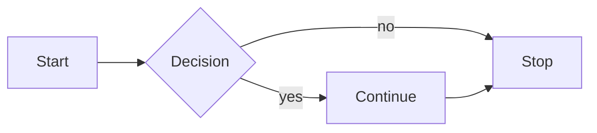
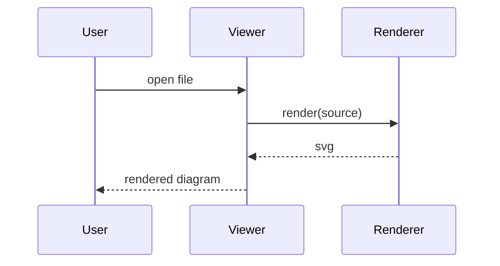
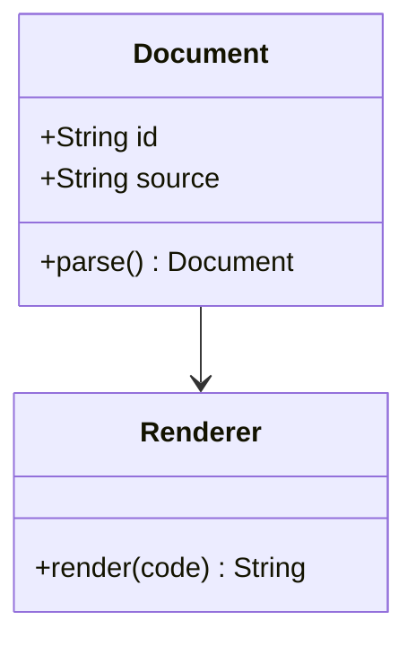
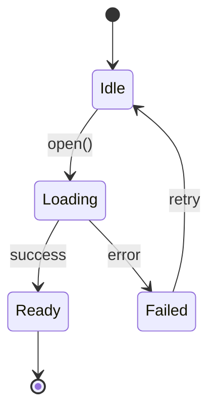
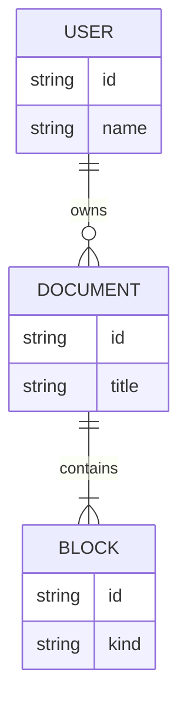
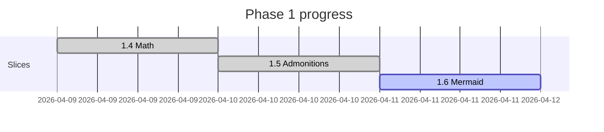

# Mermaid diagram fixture

This fixture exercises every diagram type the viewer must support
plus one deliberately broken source. It is parsed by widget tests
and by the manual on-device smoke pass.

## Flowchart



## Sequence diagram



## Class diagram



## State diagram



## Entity-relationship diagram



## Gantt chart



## Broken diagram (regression guard)

The block below is intentionally invalid. The viewer must render
the inline error placeholder for it instead of crashing the rest
of the document — every following block must continue to render.

```mermaid
flowchart LR
    A -->
```

## Trailing prose

A paragraph after the broken diagram. If you can read this in the
running app, the error path stayed inline and did not poison the
document tree.
